- [远程调用 RestTemplate](#远程调用-resttemplate)
- [eureka + RestTemplate](#eureka--resttemplate)
  - [新建 eureka-server 模块](#新建-eureka-server-模块)
  - [其他模块（服务注册）](#其他模块服务注册)
- [nacos + RestTemplate](#nacos--resttemplate)
- [feign + HttpClient + nacos](#feign--httpclient--nacos)
- [feign-api模块写法](#feign-api模块写法)
- [gateway](#gateway)
- [--------------](#--------------)
- [eureka 机制](#eureka-机制)
- [Ribbon设置为什么无效？](#ribbon设置为什么无效)
- [Ribbon 机制](#ribbon-机制)
- [Ribbon 负载均衡策略](#ribbon-负载均衡策略)
- [Ribbon 修改负载均衡策略](#ribbon-修改负载均衡策略)
- [Ribbon 饥饿加载](#ribbon-饥饿加载)
- [feign的自定义配置](#feign的自定义配置)
- [feign的两种写法](#feign的两种写法)
- [GateWay网关](#gateway网关)
- [gateway的路由断言](#gateway的路由断言)
- [gateway的路由过滤器](#gateway的路由过滤器)
- [gateway的路由过滤器执行顺序](#gateway的路由过滤器执行顺序)
- [gateway跨域问题](#gateway跨域问题)

---

三种方案：
- 远程调用 RestTemplate：ip
- RestTemplate + eureka / nacos: 服务名
- feign + eureka / nacos: 服务名、比 RestTemplate 更能处理复杂的url 和 更好的可读性。

[RestTemplate + eureka](../../codes/cloud/eureka_demo/pom.xml) 

[RestTemplate + nacos](../../codes/cloud/nacos_demo/pom.xml)

[feign + HttpClient + nacos](../../codes/cloud/feign_demo/order-service/src/main/java/com/sword/order/controller/OrderController.java)

## 远程调用 RestTemplate


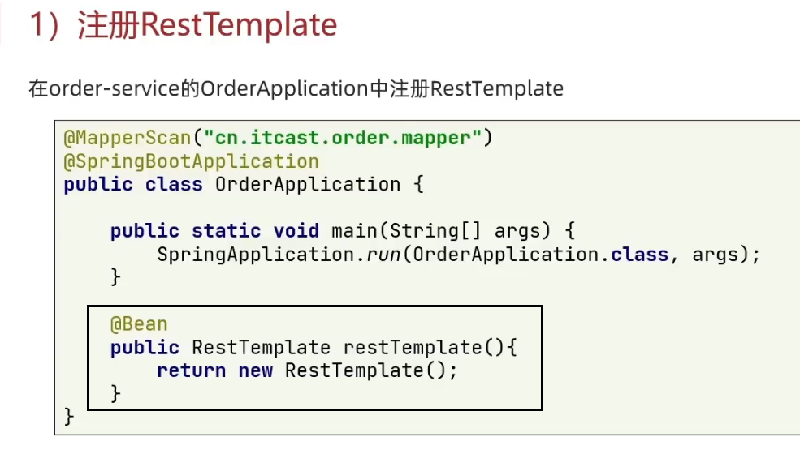

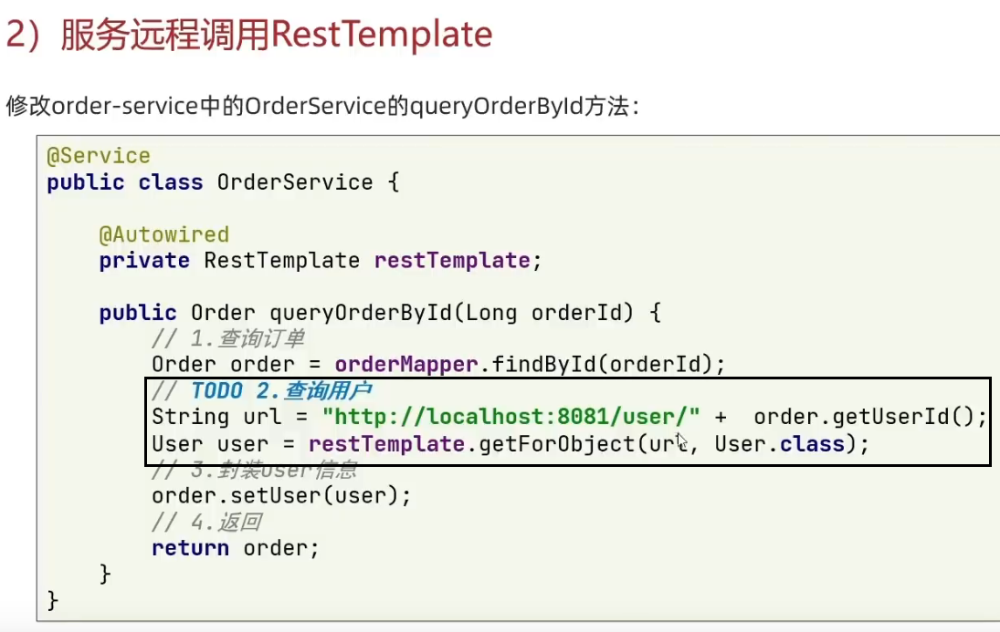

## eureka + RestTemplate

eureka-server 模块是 eurake的服务端。

其他模块是 eurake的客户端。

### 新建 eureka-server 模块

1. server依赖
```xml
<!-- eureka-server -->
<!-- 不用配置版本，已由spring-cloud-dependencies的版本确定 -->
<dependency>
    <groupId>org.springframework.cloud</groupId>
    <artifactId>spring-cloud-starter-netflix-eureka-server</artifactId>
</dependency>
```

2. application.yml文件

```yaml
server:
  port: 10086       # eureka 的端口
spring:
  application:
    name: eureka-server

# 注册该服务到eureka，自己也要注册
eureka:
  client:
    service-url: 
      defaultZone: http://127.0.0.1:10086/eureka   
```
3. 启动类 `@EnableEurekaServer` 注解，开启eureka的注册中心功能：

```java
package cn.itcast.eureka;

import org.springframework.boot.SpringApplication;
import org.springframework.boot.autoconfigure.SpringBootApplication;
import org.springframework.cloud.netflix.eureka.server.EnableEurekaServer;

@SpringBootApplication
@EnableEurekaServer
public class EurekaApplication {
    public static void main(String[] args) {
        SpringApplication.run(EurekaApplication.class, args);
    }
}
```

### 其他模块（服务注册）
1. client 依赖
```xml
<!-- eureka-client -->
<dependency>
    <groupId>org.springframework.cloud</groupId>
    <artifactId>spring-cloud-starter-netflix-eureka-client</artifactId>
</dependency>
```
2. application.yml文件

```yaml
spring:
  application:
    name: userservice

eureka:
  client:
    service-url:
      defaultZone: http://127.0.0.1:10086/eureka
```

3. 修改远程调用：url修改为**服务名称**

    方式1：不使用负载均衡，还需要端口号来指定哪个端口。

    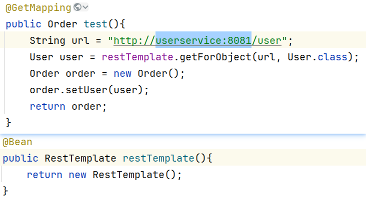

    方式2：`@LoadBalanced` 负载均衡, 自动决定使用哪个具体的服务和端口号。也可以继续指定端口号。

    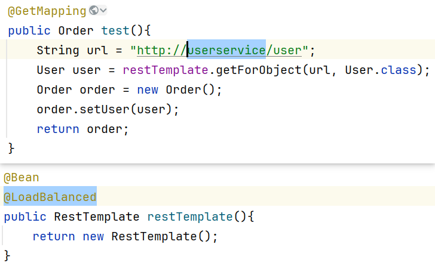


启动微服务，然后在浏览器访问：http://127.0.0.1:10086

## nacos + RestTemplate

1. 导入nacos服务注册和RestTemplate上的`@LoadBalanced`所需的spring-cloud-starter-loadbalancer。见：[如何使用nacos配置中心](./nacos服务注册.md#如何将服务注册到nacos)
2. 配置文件种添加nacos服务中心信息
3. 发起远程调用

## feign + HttpClient + nacos

> nacos、loadbalancer

feign也需要spring-cloud-starter-loadbalancer

见：[如何使用nacos配置中心](./nacos服务注册.md#如何将服务注册到nacos)

> feign + HttpClient

Feign底层发起http请求，依赖于其它的框架。其底层客户端实现包括：
- URLConnection：默认实现，不支持连接池
- Apache HttpClient ：支持连接池
- OKHttp：支持连接池

orderservice是发起者

1. orderservice 引入依赖 

    ```xml
    <!--feign的依赖 -->
    <dependency>
        <groupId>org.springframework.cloud</groupId>
        <artifactId>spring-cloud-starter-openfeign</artifactId>
    </dependency>
    <!--httpClient的依赖 -->
    <dependency>
        <groupId>io.github.openfeign</groupId>
        <artifactId>feign-httpclient</artifactId>
    </dependency>
    ```

    ```yaml
    feign:
      httpclient:
        enabled: true # 开启feign对HttpClient的支持
        max-connections: 200            # 最大的连接数
        max-connections-per-route: 50   # 每个路径的最大连接数
    ```

2. orderservice 中创建远程调用 userservice 的 **feignclient 接口**
    ```java
    @FeignClient("userservice")     // 指定要调用的服务名
    public interface UserClient {
        @GetMapping("/user")        // 路径
        public User test();         // 参数和返回值要和对应的controller中的方法一样。但方法名随便，毕竟服务名和路径已经确定。
    }
    ```
    
3. orderservice 启动类添加 `@EnableFeignClients`

    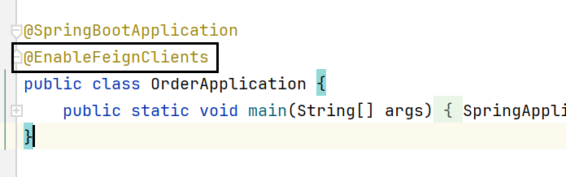
  
4. orderservice 中注入 feignclient

    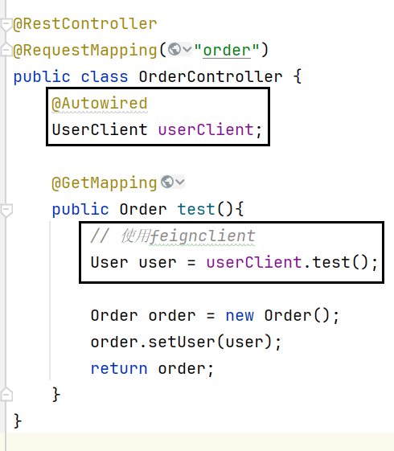


## feign-api模块写法

1. 创建一个 feign-api 的module。
    
    无须启动类来启动服务来向nacos注册。
    
    只是用来定义一些公共类feignclient之类的和远程调用的依赖(可得有nacos和loadbalancer，其他模块需要)，让其他模块导入而使用。

    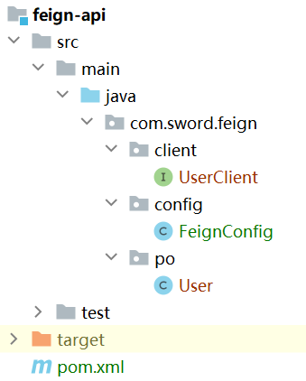

    ```yml
    <!-- 服务发现 -->
    <dependency>
        <groupId>com.alibaba.cloud</groupId>
        <artifactId>spring-cloud-starter-alibaba-nacos-discovery</artifactId>
    </dependency>
    <!-- loadbalancer -->
    <dependency>
        <groupId>org.springframework.cloud</groupId>
        <artifactId>spring-cloud-starter-loadbalancer</artifactId>
    </dependency>
    <!-- feign -->
    <dependency>
        <groupId>org.springframework.cloud</groupId>
        <artifactId>spring-cloud-starter-openfeign</artifactId>
    </dependency>
    <!--httpClient的依赖 -->
    <dependency>
        <groupId>io.github.openfeign</groupId>
        <artifactId>feign-httpclient</artifactId>
    </dependency>
    ```

2. order-service 只需要导入 feign-api 模块，就有了feignclient和远程调用的相关依赖。

    ```xml
    <!-- feign-api -->
    <dependency>
        <groupId>com.sword</groupId>
        <artifactId>feign-api</artifactId>
        <version>1.0-SNAPSHOT</version>
    </dependency>
    ```
    配置连接池，nacos，loadbalancer
    ```yaml
    server:
      port: 8080
    spring:
      application:
        name: orderservice
      cloud:
        nacos:
          server-addr: 192.168.150.3:8848   # nacos服务器地址
          discovery:
            cluster-name: HZ
        # 由于我们用的版本新而使用spring-cloud-starter-loadbalancer，需要让其开启使用nacos（默认false）。否则，是不分集群位置的轮询
        loadbalancer:
          nacos:
            enabled: true

    feign:
      httpclient:
        enabled: true # 开启feign对HttpClient的支持
        max-connections: 200            # 最大的连接数
        max-connections-per-route: 50   # 每个路径的最大连接数
    ```
    配置启动类来使用feign。
    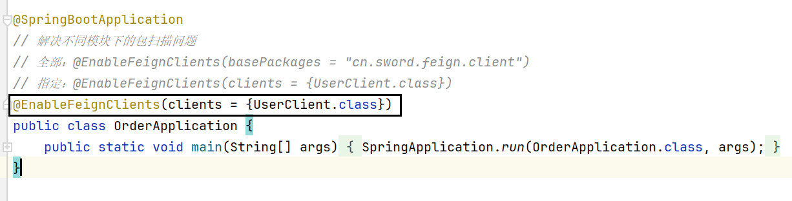

    注入和使用feignclient发起远程调用

    

## gateway

1. 新建gateway模块
    ```xml
    <!--网关-->
    <dependency>
        <groupId>org.springframework.cloud</groupId>
        <artifactId>spring-cloud-starter-gateway</artifactId>
    </dependency>
    <!--nacos服务发现依赖-->
    <dependency>
        <groupId>com.alibaba.cloud</groupId>
        <artifactId>spring-cloud-starter-alibaba-nacos-discovery</artifactId>
    </dependency>
    <!-- loadbalancer: gateway的uri的lb形式用到服务名，就需要loadbalancer依赖 -->
    <dependency>
        <groupId>org.springframework.cloud</groupId>
        <artifactId>spring-cloud-starter-loadbalancer</artifactId>
    </dependency>
    ```
2. 启动类，和编写配置文件

    port, name; 向nacos注册；gateway路由规则（路由id、路由的目标地址、路由断言、过滤器）。
    ```yml
    server:
      port: 10010
    spring:
      application:
        name: gateway
      cloud:
        nacos:
          server-addr: 192.168.150.3:8848   # nacos服务器地址
        gateway:
          routes:
            - id: user  # 路由id，自定义，只要唯一即可
              # 路由的目标地址。注意是 uri，不是url。
              # http就是固定地址 lb就是根据服务名的负载均衡。
              # uri: http://localhost:8081
              uri: lb://userservice   
              # 路由断言
              predicates:
                - Path=/user/**
            - id: order
              uri: lb://orderservice
              predicates:
                - Path=/order/**
    ```

gateway 的负载均衡 和 loadbalancer （及nacos的负载均衡），是不冲突的，因为就不是一回事。
- gateway是用户在浏览器访问gateway地址：`http://localhost:10010/user`
- loadbalancer是service代码之间远程调用访问的：RestTemplate、feign

## --------------


## eureka 机制

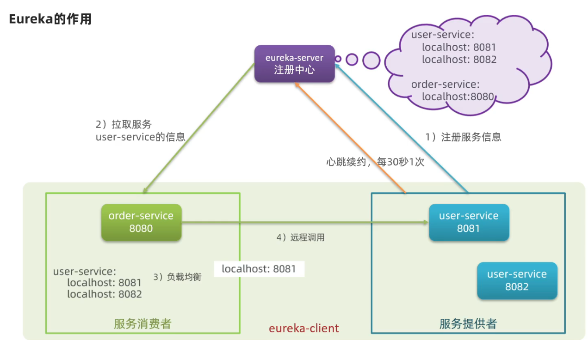

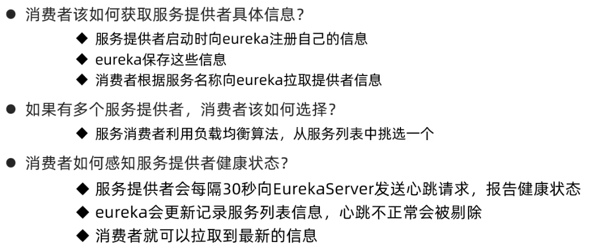

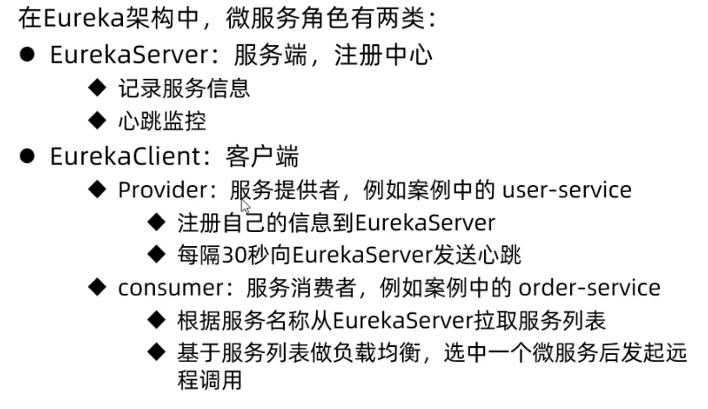

## Ribbon设置为什么无效？

RestTemplate 上的`@LoadBalanced` 点开不是 Ribbon。

因为springcloud在2020.0.0之后，移除掉了netflix-ribbon。而是使用 `org.springframework.cloud:spring-cloud-starter-loadbalancer`

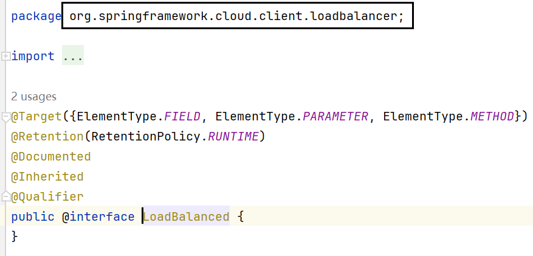


> eureka 和 nacos

- eureka-client使用的loadbalancer，使用自定义负载均衡不使用IRule接口。所有导入IRule错误。

    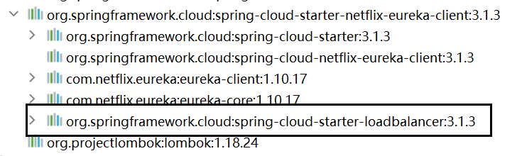

- nacos
    
    ```yml
    <!-- eureka依赖会默认带spring-cloud-starter-loadbalancer, nacos-discovery默认没有这个 -->
    <dependency>
        <groupId>org.springframework.cloud</groupId>
        <artifactId>spring-cloud-starter-loadbalancer</artifactId>
    </dependency>
    ```

    默认简单轮询。

## Ribbon 机制

SpringCloudRibbon的底层采用了一个拦截器，拦截了RestTemplate发出的请求，对地址做了修改。

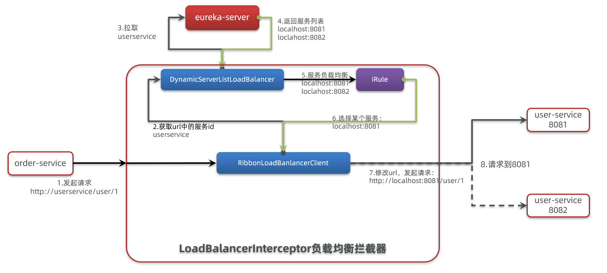

基本流程如下：

- 拦截我们的RestTemplate请求http://userservice/user/1
- RibbonLoadBalancerClient会从请求url中获取服务名称，也就是user-service
- DynamicServerListLoadBalancer根据user-service到eureka拉取服务列表
- eureka返回列表，localhost:8081、localhost:8082
- IRule利用内置负载均衡规则，从列表中选择一个，例如localhost:8081
- RibbonLoadBalancerClient修改请求地址，用localhost:8081替代userservice，得到http://localhost:8081/user/1，发起真实请求

## Ribbon 负载均衡策略

负载均衡的规则都定义在IRule接口中，而IRule有很多不同的实现类：


| **内置负载均衡规则类**    | **规则描述**                                                 |
| ------------------------- | ------------------------------------------------------------ |
| RoundRobinRule            | 简单轮询服务列表来选择服务器。 |
| AvailabilityFilteringRule | 对以下两种服务器进行忽略：   </br>（1）在默认情况下，这台服务器如果3次连接失败，这台服务器就会被设置为“短路”状态。短路状态将持续30秒，如果再次连接失败，短路的持续时间就会几何级地增加。  </br>（2）并发数过高的服务器。如果一个服务器的并发连接数过高，配置了AvailabilityFilteringRule规则的客户端也会将其忽略。并发连接数的上限，可以由客户端的`<clientName>.<clientConfigNameSpace>.ActiveConnectionsLimit`属性进行配置。 |
| WeightedResponseTimeRule  | 为每一个服务器赋予一个权重值。服务器响应时间越长，这个服务器的权重就越小。这个规则会随机选择服务器，这个权重值会影响服务器的选择。 |
| **ZoneAvoidanceRule**     | 以区域可用的服务器为基础进行服务器的选择。使用Zone对服务器进行分类，这个Zone可以理解为一个机房、一个机架等。而后再对Zone内的多个服务做轮询。 |
| BestAvailableRule         | 忽略那些短路的服务器，并选择并发数较低的服务器。             |
| RandomRule                | 随机选择一个可用的服务器。                                   |
| RetryRule                 | 重试机制的选择逻辑                                           |


> **注意**，一般用默认的负载均衡规则，不做修改。默认的实现就是ZoneAvoidanceRule，是一种轮询方案

## Ribbon 修改负载均衡策略

方式1：在某个微服务的application.yml文件中。效果是OrderService访问不同的微服务用不同的策略。

```yaml
userservice: # OrderService的application.yml中，访问userservice服务
  ribbon:
    NFLoadBalancerRuleClassName: com.netflix.loadbalancer.RandomRule # 负载均衡规则 
```


方式2：在某个微服务的启动类中定义一个新的IRule。效果是OrderService访问其他微服务都是这个策略。

```java
@SpringBootApplication
public class OrderApplication {
    public static void main(String[] args) {
        SpringApplication.run(OrderApplication.class, args);
    }

    @Bean
    @LoadBalanced
    public RestTemplate restTemplate() {
        return new RestTemplate();
    }

    // 应该是按类型注入，名字随便起？
    @Bean
    public IRule randomRule(){
        return new RandomRule();
    }
}
```

PS：[这些方法在现在都无效，因为现在不用ribbon了](#ribbon设置为什么无效)

## Ribbon 饥饿加载

Ribbon默认是采用懒加载，即第一次访问时才会去创建 RibbonLoadBalancerClient, 拉去服务，请求时间会很长。

而饥饿加载则会在项目启动时创建，降低第一次访问的耗时，通过下面配置开启饥饿加载：

```yaml
ribbon:
  eager-load:
    enabled: true
    clients:    # 让OrderService直接拉取userservice服务
      - userservice    
```

## feign的自定义配置

| 类型                   | 作用             | 说明                                                   |
| ---------------------- | ---------------- | ------------------------------------------------------ |
| **feign.Logger.Level** | 修改日志级别     | 包含四种不同的级别：NONE、BASIC、HEADERS、FULL         |
| feign.codec.Decoder    | 响应结果的解析器 | http远程调用的结果做解析，例如解析json字符串为java对象 |
| feign.codec.Encoder    | 请求参数编码     | 将请求参数编码，便于通过http请求发送                   |
| feign. Contract        | 支持的注解格式   | 默认是SpringMVC的注解                                  |
| feign. Retryer         | 失败重试机制     | 请求失败的重试机制，默认是没有，不过会使用Ribbon的重试 |

一般情况下，就修改个**日志配置 feign.Logger.Level**，使用NONE或BASIC。
- NONE：不记录任何日志信息，这是**默认值**。
- BASIC：仅记录请求的方法，URL以及响应状态码和执行时间
- HEADERS：在BASIC的基础上，额外记录了请求和响应的头信息
- FULL：记录所有请求和响应的明细，包括头信息、请求体、元数据。


Feign的日志配置:
- 方式一是配置文件, `feign.client.config.xxx.loggerLevel`.
    
    ①如果xxx是default则代表全局
    
    ②如果xxx是服务名称，例如userservice则代表某服务

    ```yaml
    feign:  
      client:
        config:           
          # default:    # 写default就是全局配置
          userservice:  # 针对某个微服务的配置
            loggerLevel: FULL #  日志级别 
    ```


- 方式二是java代码配置 `Logger.Level` 这个Bean

    
    ```java
    public class FeignConfig  {
        @Bean
        public Logger.Level feignLogLevel(){
            return Logger.Level.BASIC; // 日志级别为BASIC
        }
    }
    ```
  
    ①全局: `@EnableFeignClients`的启动类上

    ```java
    @EnableFeignClients(defaultConfiguration = FeignConfig.class) 
    ```
  
    ②某服务: `@FeignClient`的feignclient的接口上

    ```java
    @FeignClient(value = "userservice", configuration = FeignConfig.class) 
    ```

【FUck，两种方式都没成功】

## feign的两种写法

> 继承方式

一样的代码可以通过继承来共享：

1）定义一个API接口，利用定义方法，并基于SpringMVC注解做声明。

2）Feign客户端和Controller都集成改接口

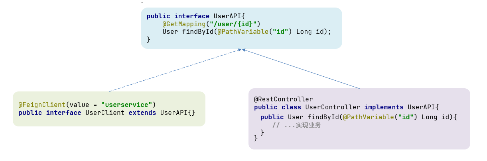

优点：

- 简单
- 实现了代码共享

缺点：

- 服务提供方、服务消费方紧耦合

- SpringMVC参数列表中的注解映射并不会继承，因此Controller中必须再次声明方法、参数列表、注解

> feign-api模块（主流）

将Feign的Client抽取为独立模块，并且把接口有关的POJO、默认的Feign配置都放到这个模块中，提供给所有消费者使用。

例如，将UserClient、User、Feign的默认配置都抽取到一个feign-api包中，所有微服务引用该依赖包，即可直接使用。

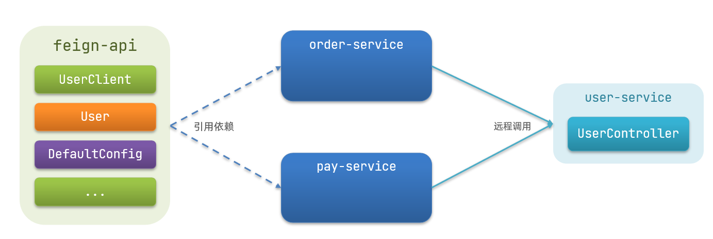

## GateWay网关

GateWay网关的**核心功能特性**
- 请求路由
- 权限控制
- 限流

gateway路由规则（路由id、路由的目标地址、路由断言、过滤器）

## gateway的路由断言

配置文件中写的路由断言，会被断言工厂Predicate Factory读取并处理。

`Path=/user/**`的路由断言是由`org.springframework.cloud.gateway.handler.predicate.PathRoutePredicateFactory`类来处理的


| **名称**   | **说明**                       | **示例**                                                     |
| ---------- | ------------------------------ | ------------------------------------------------------------ |
| After      | 是某个时间点后的请求           | `-  After=2037-01-20T17:42:47.789-07:00[America/Denver]`       |
| Before     | 是某个时间点之前的请求         | `-  Before=2031-04-13T15:14:47.433+08:00[Asia/Shanghai]`       |
| Between    | 是某两个时间点之前的请求       | `-  Between=2037-01-20T17:42:47.789-07:00[America/Denver],  2037-01-21T17:42:47.789-07:00[America/Denver]` |
| Cookie     | 请求必须包含某些cookie         | `- Cookie=chocolate, ch.p`                                     |
| Header     | 请求必须包含某些header         | `- Header=X-Request-Id, \d+`                                   |
| Host       | 请求必须是访问某个host（域名） | `-  Host=**.somehost.org,**.anotherhost.org`                   |
| Method     | 请求方式必须是指定方式         | `- Method=GET,POST`                           |
| **Path**       | 请求路径必须符合指定规则       | `- Path=/red/{segment},/blue/**`                               |
| Query      | 请求参数必须包含指定参数       | `- Query=name, Jack或者-  Query=name`                          |
| RemoteAddr | 请求者的ip必须是指定范围       | `- RemoteAddr=192.168.1.1/24`                                  |
| Weight     | 权重处理                       |                                                              |

## gateway的路由过滤器

过滤器的作用是什么？对路由的请求或响应做加工处理，比如添加请求头

几种过滤器：当前路由的过滤器filters、默认路由过滤器default-filters、全局路由过滤器GlobalFilter。

当前路由的过滤器filters、默认路由过滤器default-filters是固定提供好的逻辑，而全局路由过滤器GlobalFilter可用自定义逻辑。比如，登录状态判断、权限校验、请求限流等。

这些都是GatewayFilter类型。

> 当前路由的过滤器filters、默认路由过滤器default-filters: 通过配置定义

```yaml
spring:
  cloud:
    gateway:
      routes:
      - id: user-service 
        uri: lb://userservice 
        predicates: 
        - Path=/user/**
        filters: # 当前路由的过滤器。仅仅对访问 userservice 的请求有效
        - AddRequestHeader=token, d0391ecb   # 添加请求头
      default-filters:    # 默认路由过滤器。对所有的路由都生效
      - AddRequestHeader=token, d0391ecb   # 添加请求头
```

Spring提供了31种不同的路由过滤器工厂。例如：

| **名称**             | **说明**                     |
| -------------------- | ---------------------------- |
| AddRequestHeader     | 给当前请求添加一个请求头     |
| RemoveRequestHeader  | 移除请求中的一个请求头       |
| AddResponseHeader    | 给响应结果中添加一个响应头   |
| RemoveResponseHeader | 从响应结果中移除有一个响应头 |
| RequestRateLimiter   | 限制请求的流量               |

> 全局路由过滤器GlobalFilter: 实现GlobalFilter接口

```java
import org.springframework.cloud.gateway.filter.GatewayFilterChain;
import org.springframework.cloud.gateway.filter.GlobalFilter;
import org.springframework.core.annotation.Order;
import org.springframework.http.HttpStatus;
import org.springframework.stereotype.Component;
import org.springframework.web.server.ServerWebExchange;
import reactor.core.publisher.Mono;

@Order(-1)      // 默认值是Integer.MAX_VALUE，表示最后执行
@Component
public class AuthorizeFilter implements GlobalFilter {
    /* 
      Mono<Void> filter(ServerWebExchange exchange, GatewayFilterChain chain): 
        @param exchange 请求上下文，里面可以获取Request、Response等信息
        @param chain 用来把请求委托给下一个过滤器 
        @return {@code Mono<Void>} 返回标示当前过滤器业务结束 
    */
    @Override
    public Mono<Void> filter(ServerWebExchange exchange, GatewayFilterChain chain) {
        // 1.获取请求参数
        ServerHttpRequest request = exchange.getRequest();
        MultiValueMap<String, String> params = request.getQueryParams();
        // 2.获取authorization参数
        String auth = params.getFirst("authorization");
        // 3.校验
        if ("admin".equals(auth)) {
            // 放行
            return chain.filter(exchange);
        }
        // 4.拦截
        // 4.1.禁止访问，设置状态码
        exchange.getResponse().setStatusCode(HttpStatus.FORBIDDEN);
        // 4.2.结束处理
        return exchange.getResponse().setComplete();
    }
}
```

## gateway的路由过滤器执行顺序


请求路由后，会将当前路由过滤器filters、默认路由过滤器default-filters、全局路由过滤器GlobalFilter，合并到一个过滤器链（集合）中，排序后依次执行每个过滤器。


排序的规则是什么呢？
1. 每一个过滤器都必须指定一个int类型的order值，**根据order值顺序执行**：
     - filters和defaultFilter的order由Spring指定，默认是按照声明顺序从1递增。
     - GlobalFilter通过实现`Ordered`接口，或者添加`@Order`注解来指定order值，由我们自己指定。
2. 当过滤器的order值一样时，会按照 defaultFilter > filters > GlobalFilter的顺序执行。

## gateway跨域问题


在gateway服务的application.yml文件中，添加下面的配置：

```yaml
spring:
  cloud:
    gateway:
      globalcors: # 全局的跨域处理
        add-to-simple-url-handler-mapping: true # 解决CORS的options请求被拦截问题
        corsConfigurations:
          '[/**]':
            allowedOrigins: # 允许哪些网站的跨域请求 
              # - "*"
              - "http://192.168.150.3:8800"   # 对应浏览器访问路径：http://192.168.150.3:8800/test/
            allowedMethods: # 允许的跨域ajax的请求方式
              - "GET"
              - "POST"
              - "DELETE"
              - "PUT"
              - "OPTIONS"
            allowedHeaders: "*"     # 允许在请求中携带的头信息
            allowCredentials: true  # 是否允许携带cookie
            maxAge: 360000          # 这次跨域检测的有效期。因为每次都会CORS询问，耗费性能，故而有效期内让其不再询问。
```

比如，放在nginx中的html 

```html
/
```