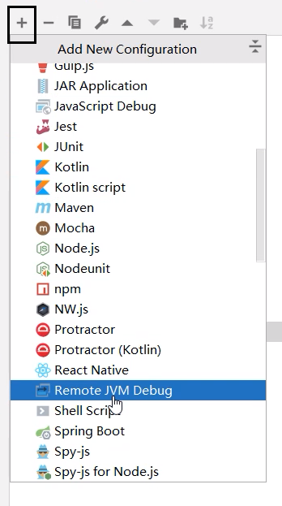
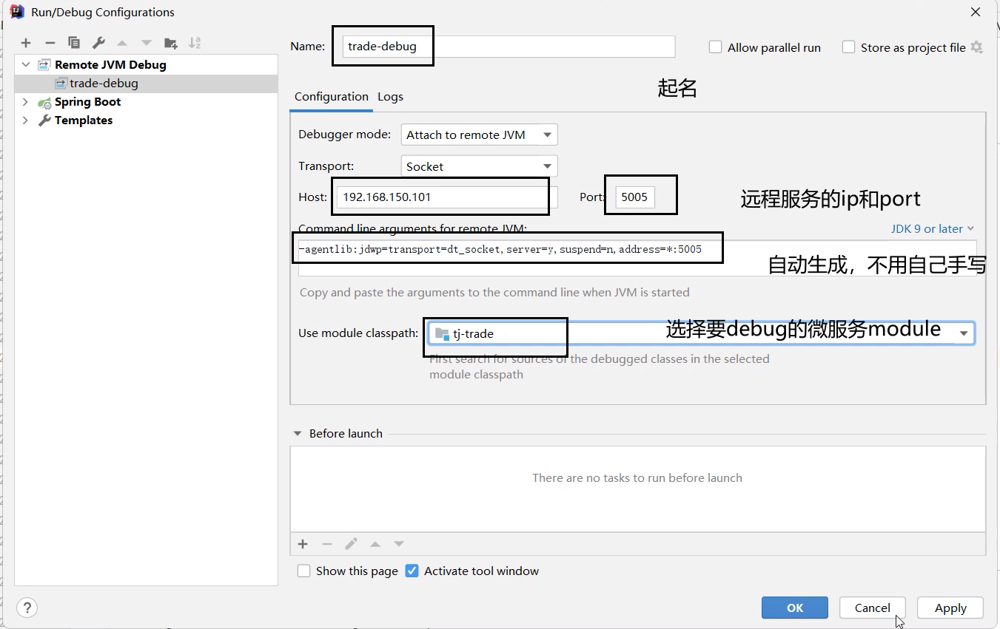
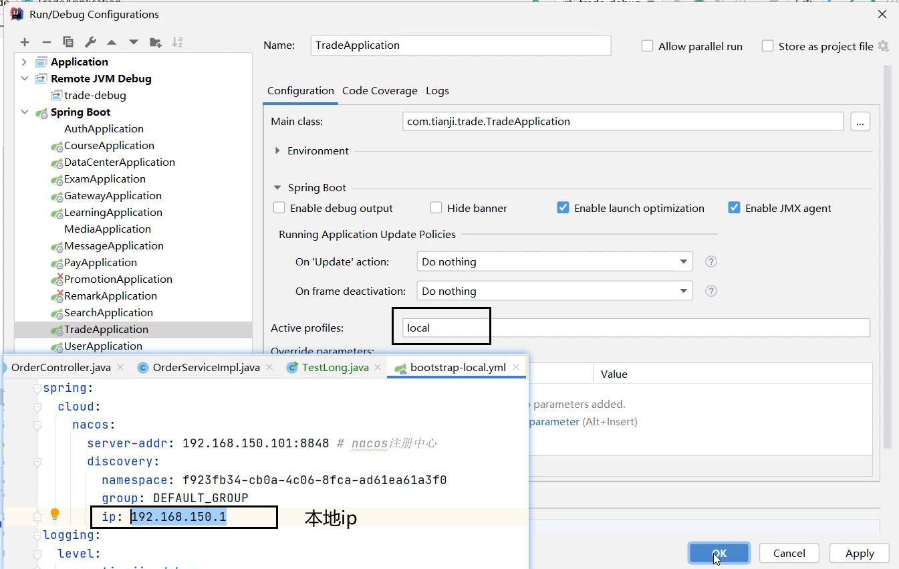

方式有二：

方式1：远程服务jvm + 本地的远程调试

方式2：本地服务、调制 + 注册到远程。

## 方式1

本地的代码和远程运行的jar包的代码要一致。

1. 本地的远程调试
    
    

    

2. 让远程服务以接受调试的方式启动jar包：带上那一堆参数
    
    

3. 只能以debug方式启动

    
## 方式2

本地服务、调制

注册到远程

PS：CORS跨域问题（没有完全测试）
- nginx是在虚拟机上
- gateway微服务，如果是在本地，那么失败；如果是在虚拟机，那么成功。
- 其他微服务可以在本地上，因为后端内部是服务名的远程调用，nacos提供地址了。