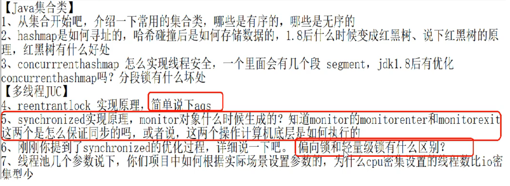

## final和finally和finalize的区别
## HashMap的底层原理、扩容机制源码
## ConcurrentHashMap
## 有哪些方式创建对象

new

反射
## 抽象类和接口的区别

## 如果try中return 2,finally中return 3。请问最终会返回多少。（3）
## 对于解决哈希冲突来说，常见的方法
## 那Java中用来解决hash冲突的方法是什么，底层的实现细节（关于为什么是8，我说的是因为泊松分布，面试官说其实按魔法数理解会合适一些）

## hascode的底层实现

【无符号右移十六位按位异或，然后再与n-1做与运算】

hashcode的6种生成策略： https://zhuanlan.zhihu.com/p/348612455
## equals和hashcode都必须重写吗

在没有散列表的情况下，hashCode和equals其实是没有关系的，hashcode并没有什么作用。equals相等，hashcode也可以不等。

当对象会被散列表存储时，必须重写equals() 和 hashCode()方法。且equals()相等时，hashCode()也必须相等。

## equals()既然已经能实现对比的功能了，为什么还要hashCode()呢？

因为重写的equals（）里一般比较的比较全面比较复杂，这样效率就比较低，而利用hashCode()进行对比，则只要生成一个hash值进行比较就可以了，效率很高。

## hashCode()既然效率这么高为什么还要equals()呢？

因为hashCode()并不是完全可靠，有时候不同的对象他们生成的hashcode也会一样（生成hash值得公式可能存在的问题），所以hashCode()只能说是大部分时候可靠，并不是绝对可靠，所以我们可以得出：

hashCode()相等的两个对象他们的equals()不一定相等，也就是hashCode()不是绝对可靠的。

equals()相等的两个对象他们的hashCode()肯定相等，也就是用equals()对比是绝对可靠的。
## 为什么要重写 hashcode 和 equals 方法？

因为原生的hashcode和equals 只是比较类似内存地址的唯一值，也就是说必须是new出的同个对象才返回相等，跟对象里的业务值没关系。 但是有的场景比如订单对象，很明显当订单号相同的两个订单对象就应该是相等的，于是我们需要重写hashcode 和equals 只判断订单号相等则对象相等。

## 了解什么设计模式吗？
设计模式是指在软件开发中，经过实践验证的通用解决方案。常见的设计模式有以下几种：

1.  工厂模式：将对象的创建和使用分离，客户端只需知道产品的接口，无需关心具体实现。
2.  单例模式：保证一个类只有一个实例，并提供全局访问点。
3.  观察者模式：对象间的一种一对多的依赖关系，当一个对象状态发生改变时，所有依赖它的对象都会得到通知并自动更新。
4.  装饰器模式：动态地给一个对象添加一些额外的职责，同时又不改变其结构。
5.  策略模式：定义一系列算法，将每个算法封装起来并可互换使用，使得算法的变化不会影响到使用算法的客户端。
6.  适配器模式：将一个类的接口转换成客户端所期望的另一个接口，使得原本由于接口不兼容而不能一起工作的类可以一起工作。
7.  模板方法模式：定义一个算法的骨架，将一些步骤延迟到子类中实现，使得子类可以不改变算法的结构即可重定义该算法的某些特定步骤。
8.  建造者模式：将一个复杂对象的构建与其表示分离，使得同样的构建过程可以创建不同的表示。
---
## JVM的内存结构
## JVM怎么判断一个对象没有被使用（引用计数法，可达性算法）
## 堆空间的基本结构（伊甸园，幸存区from/to，老年代）
---
## 脏读？

【读取的不是最新的？】A读取到x=0，A修改x+=1，但在A还没写入前，B读取x=0，供后续操作（此时A已写入x=1，B操作x+=1，再写入x=1，但原本应该是x=2）。

脏读( Drity Read:某个事务已更新一份数据,另一个事务在此时读取了同一份数据,由于某些原因,前一个事务RollBack了操作,则后个事务所读取的数据就会是不正确的。
经典案例1：
张三和李四银行账户都为1000，张三声称要给李四转账500，但是在数据库操作中张三update了数据（张三账户-500，李四账户+500）后，并未commit事务，此时李四的事务进行查询时就是一个临时数据（李四账户查询+500），此后张三未提交事务，进行回滚操作，则张三并未转账。

## sql语言怎么实现乐观锁和悲观锁（for update，version版本控制）
## 数据库的事务级别
## MySQL的索引
## MySQL的日志文件
---
## 单点登录是怎么实现的
## 为什么用JWT？
单点登录：单点登录的英文名叫做：Single Sign On（简称SSO），指在同一帐号平台下的多个应用系统中，用户只需登录一次，即可访问所有相互信任的系统。简而言之，多个系统，统一登陆。

http无状态：如果用户向我们的应用提供了用户名和密码来进行用户认证，认证通过后HTTP协议不会记录下认证后的状态，那么下一次请求时，用户还要再一次进行认证，因为根据HTTP协议，我们并不知道是哪个用户发出的请求。为了识别是哪个用户，我们只能在用户首次登录成功后，在服务器存储一份用户登录的信息，这份登录信息会在响应时传递给浏览器，告诉其保存为cookie，以便下次请求时发送给我们的应用，这样我们的应用就能识别请求来自哪个用户了。

```
browser  -----------请求登录认证------->   server
         <---返回cookie(含SessionId)---
         ----------业务请求+cookie----->   判断SessionId
```

## cookie的问题

- cookie不可用。移动端经常不支持cookie、浏览器禁用了cookie
- cookie无法跨域。
- CSRF 跨站域请求伪造攻击：Cookie被截获
## 常见的实现登录的方式有哪些

传统Session

token

cookie+session

redis+token

jwt

## 传统Session


- 缺点：因为存服务器和cookie。
  - 服务器开销大。每个用户都会保存一份Session，用户数量过多。
  - 分布式不可用。服务器作负载均衡，其他服务器无Session要重新登录。解法Session复制、【Session统一保存Redis】
  - 不适合含有多个中间件的后端部署。cookie中关于session的信息会转发多次
  - cookie的问题……

## redis+token（redis做登录的话，其中存了什么东西）


优点：
其核心优点实服务端可以主动让token失效，并且解决了Cookie+Session暴露的一些问题


缺点：

- 中心化的：要能识别token必须能访问该Redis，要求每次token都实时检测；
- 占用redis存储空间
- 每次都要查询完Redis返回的username后，还要去数据库中查询想要的信息，增大了服务器的压力


## 为什么用JWT？优点？缺点？


优点：
- 可扩展性好 应用程序分布式部署的情况下，session需要做多机数据共享，通常可以存在数据库或者redis里面。而jwt不需要。

- 无状态 jwt不在服务端存储任何状态。RESTful API的原则之一是无状态，发出请求时，总会返回带有参数的响应，不会产生附加影响。用户的认证状态引入这种附加影响，这破坏了这一原则。另外jwt的载荷中可以存储一些常用信息，用于交换信息，有效地使用 JWT，可以降低服务器查询数据库的次数。

- JWT Token是以JSON加密形式保存在客户端的，而不是服务器中，可以减轻服务器压力

缺点：
- 安全性：
    
    我们用的是hutool工具包内的JWT生成token，如果被人知道这个信息的话，token是可以被解密的，不是很安全，不能放敏感信息。

    解决：加盐值（密钥）。每个项目的盐值都不能一样。

- token被拿到第三方使用。

    解决：对同一用户的同时登录数量进行限流。

- 一次性
    
    无状态是jwt的特点，但也导致了这个问题，jwt是一次性的。想修改里面的内容，就必须签发一个新的jwt。

    （1）无法废弃：通过上面jwt的验证机制可以看出来，一旦签发一个jwt，在到期之前就会始终有效，无法中途废弃。例如你在payload中存储了一些信息，当信息需要更新时，则重新签发一个JWT，但是由于旧的JWT还没过期，拿着这个旧的JWT依旧可以登录，那登录后服务端从JWT中拿到的信息就是过时的。为了解决这个问题，我们就需要在服务端部署额外的逻辑，例如设置一个黑名单，一旦签发了新的jwt，那么旧的就加入黑名单（比如存到redis里面），避免被再次使用。

    （2）续签：如果你使用jwt做会话管理，传统的cookie续签方案一般都是框架自带的，session有效期30分钟，30分钟内如果有访问，有效期被刷新至30分钟。一样的道理，要改变jwt的有效时间，就要签发新的jwt。最简单的一种方式是每次请求刷新jwt，即每个http请求都返回一个新的jwt。这个方法不仅暴力不优雅，而且每次请求都要做jwt的加密解密，会带来性能问题。另一种方法是在redis中单独为每个jwt设置过期时间，每次访问时刷新jwt的过期时间。

    可以看出想要破解jwt一次性的特性，就需要在服务端存储jwt的状态。但是引入 redis 之后，就把无状态的jwt硬生生变成了有状态了，违背了jwt的初衷。而且这个方案和session都差不多了。
## http和https


## 用户登录是否有过期时间，再次登录时，过期时间是顺延还是继续计时（顺延）
## cookie和session的区别（位置，安全性，生命周期，保存数据类型）
## cookie中存了什么样的信息，可以判断用户有否处于登录态（Session ID）
## cookie被伪造？会导致什么问题，怎么解决

cookie被拿到以后，通常可以换一个机器访问。

可以对cookie进行更严格的验证，例如限制cookie的IP地址或使用其他安全措施来确保cookie只能由原始用户使用。
## 为什么要将热点数据放在Redis中
## Redis为什么是单线程的
## redis锁了解过吗
## redis的一致性问题
## redis在生产中常见的问题
## redis是怎么判断当前的请求是用户A的请求还是用户B的请求(前端header中的key，然后解密)
## redis中的信息是加密的还是已经解密的
## redis怎么持久化（RDB，AOF）
## Rdis的同步策略有什么
## redis有哪几种用来做容灾的架构设计策略（单机，主从复制，哨兵，集群）
## 主从模式中，主库和从库哪个负责读哪个负责写（主）
## 哨兵模式中master挂了，接下来会做什么事情（Raft）
## 哨兵模式下，写redis是单台机器提供写的能力还是多台机器提供
## 如果写的数据量很大，redis还有其他的方案能支持更多的写吗（Redis切片集群）
## redis和mysql怎么保持数据一致性（延迟双删，异步更新缓存（基于binlog的同步机制））
## redis中的数据被删除以后，热点数据打到数据库，怎么保证数据库不会被击垮

构建mysql集群

## 秒杀

消息队列，削峰什么
## 缓存击穿

重量级锁即堆中的monitor对象

产生原因

解决策略（永久不过期，锁，布隆过滤器）+ (在工程中，偏向服务解决问题效果会更好，一般是设立多级缓存，然后在高级别的缓存中设置最为热点的数据永不过期)
## 流量削峰怎么做（排队，答题，分层过滤）
## 

##
##
##
##
##
##
##
## 静态内部类内能用this吗？

##
##
##
##
##
##
##
##
##
##
##
##
##
##
##
##
##
##
##
##
##
##
##
##
##
##
##
##
##
##
##
##
##
##
##
##
##
##
##
##
##
##
##
##
##
##
##
##
##
##
##
##
##
##
##
##
##
##
##
##
##
##
##
##
##
##
##
##
##
##
##
##
##
##
##
##
##
##
##
##
##
##
##
##
##
##
##
##
##
##
##
##
##
##
##
##
##
##
##
##
##
##
##
##
##
##
##
##
##
##
##
##
##
##
##
##
##
##
##
##
##
##
##
##
##
##
##
##
##
##
##
##
##
##
##
##
##
##
##
##
##
##
##
##
##
##
##
##
##
##
##
##
##
##
##
##
##
##