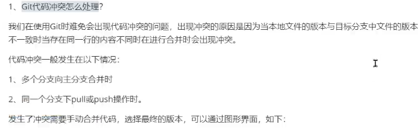

- [git冲突](#git冲突)
- [在哪个分支下开发](#在哪个分支下开发)
- [本地正在开发，不想提交，又要修改线上bug](#本地正在开发不想提交又要修改线上bug)

---
## git冲突

## 在哪个分支下开发

## 本地正在开发，不想提交，又要修改线上bug

暂存本地开发，`git stash`

修改完bug后，切换会本地分支，使用`git stash apply`来恢复。