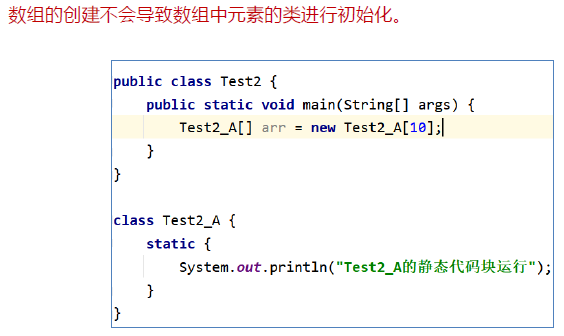
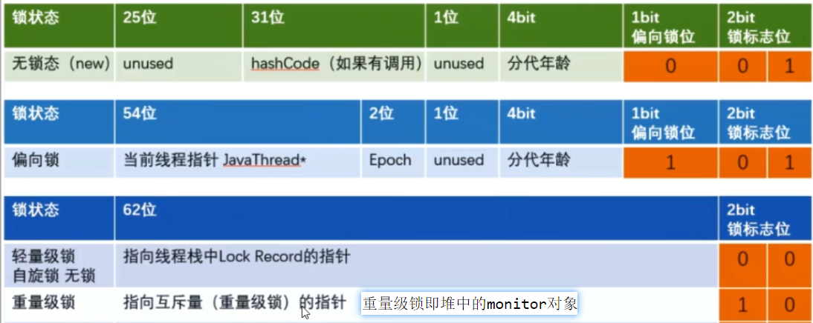

- [1. 介绍下公平锁和非公平锁](#1-介绍下公平锁和非公平锁)
- [2. 为什么会有公平锁/非公平锁的设计？为什么默认非公平锁](#2-为什么会有公平锁非公平锁的设计为什么默认非公平锁)
- [3. 什么时候用公平？什么时候用非公平？](#3-什么时候用公平什么时候用非公平)
- [4. 可重入锁是什么](#4-可重入锁是什么)
- [5. 有哪些可重入锁](#5-有哪些可重入锁)
- [6. 可重入锁的重入原理](#6-可重入锁的重入原理)
- [7. 死锁](#7-死锁)
- [8. 乐观锁和悲观锁](#8-乐观锁和悲观锁)
- [9. 乐观锁和悲观锁的区别](#9-乐观锁和悲观锁的区别)
- [10. 乐观锁和悲观锁的适用场景](#10-乐观锁和悲观锁的适用场景)
- [11. JMM](#11-jmm)
- [12. JVM的作用](#12-jvm的作用)
- [13. JMM规范下三大特性](#13-jmm规范下三大特性)
- [14. volatile](#14-volatile)
- [15. 内存屏障](#15-内存屏障)
- [16. 原子类AtomicReference](#16-原子类atomicreference)
- [17. 对象实例 new Object()](#17-对象实例-new-object)
- [18. 对象的大小](#18-对象的大小)

---
## 1. 介绍下公平锁和非公平锁

- 公平锁：按照多个线程的申请锁的顺序来获取锁。
- 非公平锁：不按照申请锁的顺序，有可能后申请的线程比先申请的线程优先获取锁。在高并发环境下，有可能造成优先级反转、饥饿的状态

PS：默认非公平锁、适用场景

## 2. 为什么会有公平锁/非公平锁的设计？为什么默认非公平锁

- 线程切换有开销。
    
    采用公平锁自然会在多个不同的线程之间切换，而采用非公平锁，很可能是同一个线程释放锁再获取锁，从而减少了线程切换的开销。

- 充分地利用CPU的时间片

    同时，恢复挂起的线程到真正锁的获取存在时间差，非公平锁能更充分地利用CPU的时间片，尽量减少CPU空间状态时间。

## 3. 什么时候用公平？什么时候用非公平？

- 为了更高的吞吐量，选择非公平锁。因为节省了很多线程切换的时间，吞吐量自然就上去了
- 为了防止优先级反转、饥饿，选择公平锁。

## 4. 可重入锁是什么

同一线程在外层获取到锁后，在内层仍然可以获取锁，并不会因为外层获取而不释放锁而陷入死锁。可重复、可递归调用

同一线程中的多个流程可以获取同一把锁，持有这把同步锁可以再次进入，自己可以获取自己的内部锁。

## 5. 有哪些可重入锁

- 隐式锁：synchronized修饰的方法或者代码块
- 显式锁（即Lock）：ReentrantLock

## 6. 可重入锁的重入原理

每个锁对象`ObjectMonitor`拥有一个指向该锁的线程的指针`_owner`、一个锁计数器`_count`、一个锁重入次数`_recursions`。

当执行monitorenter加锁指令时，根据**锁计数器**判断锁对象是否被线程占用。
- 如果锁计数器为0，则直接占用，JVM会将锁对象的持有线程设为当前线程，执行加锁操作（计数器+1，锁重入次数+1）.
- 如果锁计数器不为0，那么就要判断持有线程是不是当前线程。如果是，执行加锁操作；如果不是，那么将当前线程放入阻塞队列，等待至锁被释放。
  
当执行monitorexit解锁指令时，执行解锁操作（锁计数器-1、锁重入次数-1），并根据锁重入次数判断当前线程是否被释放：
- 如果锁重入次数为0，则说明从多层重入中全部退出，置空`_onwer`，释放锁。
- 如果锁重入次数不为0，则说明还处于多层重入中，继续持有锁对象。

synchronized锁会自动获取释放锁，而ReentrantLock锁则需要注意释放`lock.unlock()`，否则其他线程无法获取到该锁。

PS：为什么需要一个锁计数器`_count`、一个锁重入次数`_recursions`？ReentrantLock锁则需要注意释放`lock.unlock()`，否则锁重入次数不为0，还是锁的计数器不为0？

## 7. 死锁

死锁是指两个或两个以上的线程在执行过程中，因抢夺资源而造成的一种**互相等待**的现象，若无外力干涉，则它们无法再继续推进下去。

产生原因：
- 系统资源不足
- 进程运行推进顺序不合适 
- 系统资源分配不当

怎么排查：
- jstack: `jps -l`获进程号，`jstack 进程号`
- jconsole

## 8. 乐观锁和悲观锁

- 悲观锁（认为线程安全问题一定发生）：添加同步锁，让线程串行执行
    
    例如，synchronized、lock
- 乐观锁（认为线程安全没问题，直接去操作）：不加锁，只在更新时判断是否有其他线程在修改。无修改，则更新；有修改，则重试或异常。
  - 版本号法、cas法（融合版本号，判断是否是原值）
  - 解决成功率低：where stock > 0

## 9. 乐观锁和悲观锁的区别

## 10. 乐观锁和悲观锁的适用场景

乐观锁读多，悲观锁写多

## 16. 原子类AtomicReference

AtomicReference: do-while消耗CPU（尤其不适合高并发）、ABA问题。

解决ABA问题：AtomicStampedReference（+int版本号）、AtomicMarkableReference（+boolean标记位）

## 17. 对象实例 new Object()

三部分：对象头、实例数据、对齐填充。

对象头 header 具体分为，对象标记 markword 和类元信息（类型指针）。如果是数组，还有数组长度length。

- 对象标记中记载了对象的哈希码、GC标记、分代年龄、偏向锁、同步锁标志位。
- 类元信息存储的是指向方法区中该对象的类元数据Klass的首地址。

## 18. 对象的大小

对象头中，对象标记 markword 8字节，类元信息 8 字节（默认开启`-XX:+UseCompressedClassPointers`而4字节）。

对齐填充到 8 字节的整数倍。

`new Object()`的大小就是16字节。

