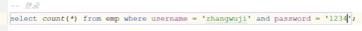
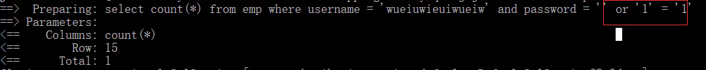
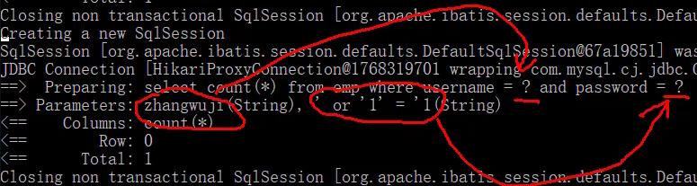

- [sql语句的功能](#sql语句的功能)
- [char varch](#char-varch)
- [where与having区别](#where与having区别)
- [er图](#er图)
- [范式](#范式)
- [sql注入](#sql注入)
- [有哪些约束](#有哪些约束)
- [事务会不会自动提交?](#事务会不会自动提交)
- [事务的ACID](#事务的acid)
- [原子性、一致性、隔离性和持久性他们分别是有什么作用？](#原子性一致性隔离性和持久性他们分别是有什么作用)
- [ACID的实现](#acid的实现)
- [事务并发的三种并发问题？脏读、不可重复读、幻读](#事务并发的三种并发问题脏读不可重复读幻读)
- [事务的隔离级别有哪几种，作用分别是？](#事务的隔离级别有哪几种作用分别是)
- [幻读问题怎么解决。](#幻读问题怎么解决)
- [MySQL的体系结构](#mysql的体系结构)
- [innodb的逻辑存储结构](#innodb的逻辑存储结构)
- [Buffer Pool](#buffer-pool)
- [🚀mysql的三种存储引擎](#mysql的三种存储引擎)
- [【索引】](#索引)
- [mysql b+树和b树](#mysql-b树和b树)
- [为什么InnoDB存储引擎选择使用B+tree索引结构?](#为什么innodb存储引擎选择使用btree索引结构)
- [InnoDB主键索引的B+tree高度为多高呢?](#innodb主键索引的btree高度为多高呢)
- [了解过索引吗？（什么是索引）](#了解过索引吗什么是索引)
- [索引的底层数据结构了解过嘛 ?](#索引的底层数据结构了解过嘛-)
- [🚀mysql的索引有哪些](#mysql的索引有哪些)
- [🚀聚集索引和二级索引](#聚集索引和二级索引)
- [🚀回表查询](#回表查询)
- [🚀聚集索引选取规则](#聚集索引选取规则)
- [联合索引底层存储结构(和其他种类的索引的存储结构有什么区别?)](#联合索引底层存储结构和其他种类的索引的存储结构有什么区别)
- [联合索引的叶子节点存的什么内容?](#联合索引的叶子节点存的什么内容)
- [🚀联合索引考察](#联合索引考察)
- [覆盖索引](#覆盖索引)
- [MYSQL超大分页怎么处理 ?](#mysql超大分页怎么处理-)
- [🚀索引失效](#索引失效)
- [索引设计原则](#索引设计原则)
- [【锁】](#锁)
- [🚀MySQ中的锁](#mysq中的锁)
- [表级锁](#表级锁)
- [行级锁](#行级锁)
- [数据库主从同步](#数据库主从同步)
- [MySQL中，如何定位慢查询?](#mysql中如何定位慢查询)
- [那这个SQL语句执行很慢, 如何分析呢？](#那这个sql语句执行很慢-如何分析呢)
- [bin log、undo log、redo log的区别](#bin-logundo-logredo-log的区别)
- [事务中的隔离性是如何保证的呢？(你解释一下MVCC)](#事务中的隔离性是如何保证的呢你解释一下mvcc)
- [MySQL主从同步原理](#mysql主从同步原理)
- [分库分表](#分库分表)
- [那你之前使用过水平分库吗？](#那你之前使用过水平分库吗)


---

## sql语句的功能

DDL, 数据定义语言，定义数据库对象结构(数据库，表，字段). create,drop,alter

DCL，数据控制语言，用来管理数据库用户、控制数据库的访问权限 grant,revoke

DML，数据操作语言，对表中的数据，insert,update,delete.

DQL，数据查询语言，对表中的数据，select.

## char varch

char 与 varchar 都可以描述字符串。

char是定长字符串，指定长度多长，就占用多少个字符，和字段值的长度无关 。而varchar是变长字符串，指定的长度为最大占用长度，实际占用长度为传入字段值长度。

char的性能会更高些，varchar更省空间。


## where与having区别
- 执行时机不同：where是分组之前进行过滤，不满足where条件，不参与分组；而having是分组
之后对结果进行过滤。
- 判断条件不同：where不能对聚合函数进行判断，而having可以。

## er图

用矩形表示实体型；

用椭圆表示实体的属性；

用菱形表示实体型之间的联系

## 范式

6nf∈**dknf**∈5nf∈4nf∈**bcnf**∈3nf∈2nf∈1nf

码：属性集合（关系中的某个属性或者某几个属性的组合）。
- 所包含的任意一个属性都不能为空
- 所有属性的组合也不能重复。才能用于区分每个元组（可以把“元组”理解为一张表中的每条记录，也就是每一行）。比如，只能将学号与课名的组合作为码，否则就无法唯一地区分每一条记录。


1NF：每列原子性。地址可以分为城市小区。

2NF：消除了非主属性对于码的部分函数依赖，从而每个表中的非主属性完全依赖于码。

（学号，课程号）这个表中的码被“学生名字”部分函数依赖。即包含有学号→学生名字这种依赖关系。不符合2NF。

3NF之间可能还会存在主键之间的依赖

巴斯-科德范式（BCNF）

## sql注入



登陆，校验用户名和密码，只需统计count结果是0还是大于0.

`' or '1'='1`



预编译sql，将整个字符串作为一个参数传入，避免了sql注入问题。



```java
// 因为 #{}不能出现在 '' 中：name like '%#{name}%'

name like '%${name}%'

name like concat('%', #{name}, '%')
```

## 有哪些约束

6个

主键、外键；非空、唯一、；默认值、检查


## 事务会不会自动提交?

MySQL 默认开启事务自动提交模式，每个单独的DML语句都将自动成为一个事务，并在执行完成后立即提交。

- 如何阻止自动提交？显式的开启事务（BEGIN 或 START TRANSACTION）。

- 如何开启自动提交：

    ```
    SET @@autocommit = 1;
    // DML语句
    ```

    或者可以在连接到数据库时在连接字符串中指定`autocommit`参数为1。

    ```
    mysql -u username -p -h hostname dbname --autocommit=1
    ```

- 如果想要禁用自动提交，可以使用以下语句：

    ```
    SET @@autocommit = 0;
    ```

    或者在连接字符串中指定`autocommit`参数为0。

## 事务的ACID

- 原子性（Atomicity）：事务中的所有操作，要么全部成功，要么全部失败回滚。
- 一致性（Consistency）：事务执行(成功提交或失败回滚)前后，数据库都应该保持一致性状态。
- 隔离性（Isolation）：多个并发的事务之间应该互相隔离，避免互相干扰。
- 持久性（Durability）：事务提交后，对数据库的修改应该永久保存，即使系统故障也不应该丢失。

PS：一致性：数据库内部的**完整性**约束、声明性约束。转账，两用户总金额不变。

## 原子性、一致性、隔离性和持久性他们分别是有什么作用？

- 原子性：保证（事务中所有操作要么全部成功，要么全部失败回滚），避免因为部分操作失败导致数据不一致或错误的结果。
- 一致性：保证（事务执行前后，数据库都应该保持一致性状态），避免数据的不一致性。
- 隔离性：保证（多个并发的事务之间应该互相隔离，避免互相干扰），避免读取到未提交的数据或者脏数据，避免并发操作导致的数据冲突。
- 持久性：保证（事务提交后，对数据库的修改应该永久保存，即使系统故障也不应该丢失），避免数据的丢失和不可恢复。

## ACID的实现

原子性和一致性：undo log

持久性：redo log

隔离性：锁和mvcc

## 事务并发的三种并发问题？脏读、不可重复读、幻读

由于多个事务同时访问数据库，而缺乏一定的隔离性和同步机制。

脏读、不可重复读、幻读是数据库中的三种并发问题：

> 脏读（Dirty Read）

脏读：读未提交。

一个事务读取了另一个事务修改但未提交的数据。比如，如果另一个事务回滚，则读取的数据是无效的

> 不可重复读（Non-Repeatable Read）：

一个事务对同一数据进行两次查询，另一个事务在两次查询期间修改了数据，导致第一个事务两次读取的数据不一致。

> 幻读（Phantom Read）

幻读与不可重复读类似，影响到事务A的**增删**逻辑。如同增删的空气墙。

事务A查询后准备插入，事务B在两次查询期间插入了数据，事务A这时插入一条和事务B一样的内容时，会报错重复数据。但是事务A中看不到晚于事务A以后其他事务提交的数据，多出的数据实际也是看不到的。

PS: 并发问题，可以采用不同的**隔离级别和锁机制**来保证数据的一致性和可靠性。

## 事务的隔离级别有哪几种，作用分别是？


数据库事务的隔离级别有四种，分别为读未提交（Read Uncommitted）、读已提交（Read Committed）、可重复读（Repeatable Read）和串行化（Serializable）。

-   读未提交：最低的隔离级别，允许一个事务读取另一个事务**未提交**的数据。这种隔离级别会导致脏读、不可重复读和幻读问题。
-   读已提交：允许一个事务读取另一个事务**已提交**的数据，避免了脏读问题。但是仍然可能存在不可重复读和幻读问题。
-   可重复读：**保证一个事务多次读取同一数据时，能够得到相同的结果**，避免了不可重复读问题。但是仍然可能存在幻读问题。
-   串行化：最高的隔离级别，**强制事务串行执行**，避免了所有并发问题，但是会导致**性能下降**。


选择合适的隔离级别取决于应用场景和性能要求。通常情况下，**可重复读, 能够在保证数据一致性的同时兼顾性能**，这也是mysql默认的隔离级别。

## 幻读问题怎么解决。

1. MySQL的默认隔离级别是可重复读，可以修改为串行化的隔离级别。

2. InnoDB 当前读下的幻读是通过间隙锁（gap_lock)来实现的。在事务A查询的时候，会锁住一个间隙，其它事务往这个间隙插入、删除等操作都是会被锁阻塞的。间隙锁和插入意向锁互斥，彻底解决了当前读下的幻读问题。

3. 但是InnoDB 没有完全解决快照读下的幻读问题。

## MySQL的体系结构

连接层、服务层、引擎层、存储层。

## innodb的逻辑存储结构

**表空间-段-区-页-行**（标段去夜航）

页也是InnoDB 存储引擎磁盘管理的最小单元，**16KB**。

## Buffer Pool

https://zhuanlan.zhihu.com/p/488819733

MySQL 的数据是存储在磁盘里的，每次去硬盘读数据太慢。引入缓存，缓冲池（Buffer Pool）来提高数据库的读写性能。在执行增删改查操作时，先操作主内存中缓冲池中的数据（若缓冲池没有数据，则从磁盘加载并缓存），然后以一定频率刷新到磁盘，从而减少磁盘IO，加快处理速度。

→ 读。缓存池中存缓存页，将磁盘中的页换进来。

→ 比起在整个缓冲池中找空闲页，用free 链表存空闲页。

→ 链表是单哨兵双向循环链表。数据结点是控制块，一个控制块对应一个缓存页，在内存中控制块1-N集中存储，后面集中存1-N的缓存页，中间可能会有碎片空间。

→ 占据满了就要被淘汰才能换新的缓存页，那么引入LRU机制。LRU链表管理被使用过的页。

→ 被使用过的页，包括没被修改的clean页和被修改过的脏页。

→ 脏页由 flush 链表管理，比起修改一次就写一次的频繁IO，集中写入 flush 链表的写入性能更高。

→ 对LRU机制还做了2.5点优化：预读失效、缓存污染。

- 脏页什么时候会被刷入磁盘？
- 几个链表，几个页
- 预读失效的young、old过程
- 缓存污染


## 🚀mysql的三种存储引擎

innodb(默认), myisam, memory

InnoDB, 支持事务、行锁和表锁、外键

MyISAM, 是不支持事务、行锁、外键, 只支持表锁。

memory存储表在内存中，不持久。

场景：
- 不要求事务，读和插入多，myisam；
- 要求事务满足ACID、增删改，适合innodb；
- 临时表和缓存，memory。


## 【索引】

## mysql b+树和b树

B+树和B树都是常用的索引结构，用于在数据库中进行高效的数据检索。它们的主要区别在于叶子节点的结构和使用方式。

B树（B-Tree）是一种多叉路衡查找树
- 每个节点可以存储多个关键字和对应的数据指针，即非叶子节点和叶子节点都会存放数据。
- 非叶子节点存放指向子节点的指针。
- 搜索有可能在非叶子结点结束

B+树：
- 非叶子节点仅仅起到索引数据作用，只存储关键字和指向子节点的指针。
- 所有的数据都会出现在叶子节点，叶子节点之间通过指针连接形成一个有序双向链表。

区别：
1. 查询稳定性：B树搜索有可能在非叶子结点结束，最好是O(1)，而B+树一定会查到叶子节点，查询稳定，logn
2. B+树磁盘IO效率更高：因为B树可能查询到非叶子节点，比都是叶子节点的B+树，就多带了子节点指针，同样一页读取的索引树就少。而且，B+树的数据存储在叶子节点上，以链表连接，在磁盘中顺序是连续的，更能利用磁盘IO的局部性原理预读。
3. B树的关键字和数据在一起，不支持范围查询，而B+树叶子节点形成链表，支持范围查询。


## 为什么InnoDB存储引擎选择使用B+tree索引结构?

> 直接说

选择B+树的主要的原因是：

第一阶数更多，路径更短，

第二个磁盘读写代价B+树更低，非叶子节点只存储指针，叶子阶段存储数据，

第三是B+树便于扫库和区间查询，叶子节点是一个双向链表

> 为什么不用红黑树

红黑树是二叉树，不如B+树阶数多、层级矮。

红黑树上逻辑相邻节点可能实际存储非常远，这种结构内存中可以快速确定位置，但不利于磁盘的局部性原理预读。

> 为什么不用Hash索引

虽然hash查询效率高，不存在hash冲突时只需要一次检索就可以了，效率通常要高于B+tree索引

但Hash索引只能用于对等比较(=，in)，不支持范围查询，无法利用索引完成排序操作


## InnoDB主键索引的B+tree高度为多高呢?

一页16KB。

innodb的指针6字节、主键即使为bigint为8字节。

一页存B+tree索引（n个key，n+1个指针），可以存 n * 8 + (n + 1) * 6 = 16 * 1024 → n = 1170

一行数据大小为1K，一页可以有16行数据。那么1171 * 16 = 18736 行数据，得出当B+树高度为2的时候可以存储18736 行数据。

高度**3**：1171 x 1171 x 16 = **2200W** 行数据


## 了解过索引吗？（什么是索引）

索引是**帮助MySQL高效获取数据的数据结构**，主要是用来提高数据检索的效率，降低数据库的IO成本，同时通过索引列对数据进行排序，降低数据排序的成本，也能降低了CPU的消耗

## 索引的底层数据结构了解过嘛 ? 

MySQL的默认的存储引擎InnoDB采用的B+树的数据结构来存储索引

## 🚀mysql的索引有哪些

索引结构有哪些：B+树索引、hash索引、空间索引、全文索引。

具体类型分为：主键索引、唯一索引、常规索引、联合索引

存储形式分为：聚集索引、二级索引。

## 🚀聚集索引和二级索引

聚簇索引主要是指**数据与索引放到一块**，B+树的叶子节点保存了**整行数据**

非聚簇索引值的是**数据与索引分开存储**，B+树的叶子节点保存对应的**主键**

- 聚集索引必须有,而且只有一个；二级索引可以有多个。
- 聚集索引直接查，二级索引还得回表查询。

## 🚀回表查询

先到二级索引中查找数据，找到**主键值**，

然后再到聚集索引中根据主键值，获取**数据**。

## 🚀聚集索引选取规则

1. 主键索引
2. 第一个唯一索引（UNIQUE）
3. 自动生成一个rowid

## 联合索引底层存储结构(和其他种类的索引的存储结构有什么区别?)

联合索引在多个列上创建索引，以提高查询性能。与单列索引相比

1.  **存储数据的组织方式**：
    
    -   单列索引只包含一个列的值和指向相应数据行的指针。
    -   联合索引则包含**多个列**的值，以及指向相应数据行的指针。
2.  **查询时的性能影响**：
    
    -   当查询条件涉及到单个索引列时，数据库可以通过单列索引来更快地定位到匹配的数据行。
    -   联合索引在适当的情况下可以提供更好的查询性能，特别是对于涉及到联合索引中**列值的组合**的查询。
3.  **索引维护的复杂性**：
    
    -   单列索引的维护相对简单，因为它只需要维护单个列的值和指针。
    -   联合索引的创建和维护相对复杂一些，当表中的数据发生变化时，数据库需要确保联合索引中的多个列值的组合保持有序，这可能需要更多的资源和时间。

## 联合索引的叶子节点存的什么内容?

索引列的值和**主键id**。

- 如果要查询语句中查询的是**表中所有的数据**，则回表。先通过联合索引树找到主键ID，然后再根据主键索引树找到对应data数据。
- 当我们查询的字段是**联合索引中的字段**，则不需要进行回表。

## 🚀联合索引考察


<details>
<summary>最左前缀法则、 > 和 >= </summary>


1. 最左前缀法则：idx_a_b_c，where查询时从最左字段开始必须存在，存在的字段生效，不存在的那列后面是部分失效。

```sql
-- a b c 都生效
select * from tb_user where a = '软件工程' and b = 31 and c = '0';
-- a b 生效
select * from tb_user where a = '软件工程' and b = 31
-- a 生效
select * from tb_user where a = '软件工程'


-- a b 生效: idx_a_b_c有顺序，select时的前后顺序无关，存在就行。
select * from tb_user where b = 31 and a = '软件工程'


-- 不生效
select * from tb_user where b = 31 and c = '0';
-- 不生效
select * from tb_user where c = '0';


-- a生效，c生效
select * from tb_user where a = '软件工程' and c = '0';
```


2. 出现范围查询(>,<)，范围查询右侧的列索引失效。当范围查询使用>= 或 <= 时，走联合索引了。

```sql
-- a生效，b失效
select * from tb_user where a = '软件工程' and b > 31

-- a生效，b生效
select * from tb_user where a = '软件工程' and b >= 31
```

</details>


## 覆盖索引

覆盖索引是指**select查询语句使用了索引，查询返回的列必须在索引中能够全部找到**。即不需要回表查询。

- id查询，它会直接走聚集索引查询，一次索引扫描，直接返回数据，性能高。
- 如果按照二级索引查询数据的时候，返回的列中没有创建索引，有可能会触发回表查询，尽量避免使用select *，尽量在返回的列中都包含添加索引的字段


## MYSQL超大分页怎么处理 ?

在数据量比较大时，使用limit分页查询，需要对数据进行排序，效率低。

优化：覆盖索引+子查询

先分页查询数据的id字段，确定了id之后，再用子查询来过滤，只查询这个id列表中的数据就可以了


## 🚀索引失效

1. 联合索引失效。
   - 跳跃某一列，索引将会部分失效。
   - 出现范围查询(>,<)，范围查询右侧的列索引失效。当范围查询使用>= 或 <= 时，走联合索引了。

2. 在索引列上进行运算操作

3. 字符串不加单引号。对于查询结果，没什么影响，但是数据库存在隐式类型转换，索引将失效。

4. 如果是**头部模糊匹配**，索引失效。如果仅仅是尾部模糊匹配，索引不会失效。

5. or连接条件。连接条件中都有索引才不失效，否则都失效。

6. MySQL评估。MySQL在查询时，会评估使用索引的效率与走全表扫描的效率，如果走全表扫描更快，则放弃索引，走全表扫描。

## 索引设计原则
- 数据量较大（单表大于10万），且查询比较频繁的表建立索引。
- 要控制索引的数量，索引并不是多多益善，索引越多，维护索引结构的代价也就越大，会影响增
- 针对于常作为查询条件（where）、排序（order by）、分组（group by）操作的字段建立索
引。
- 尽量选择区分度高的列作为索引，尽量建立唯一索引，区分度越高，使用索引的效率越高。
- 尽量使用联合索引，减少单列索引，查询时，联合索引很多时候可以覆盖索引，节省存储空间，
- 如果是字符串类型的字段，字段的长度较长，可以针对于字段的特点，建立前缀索引。
- 避免回表，提高查询效率。
- 如果索引列不能存储NULL值，请在创建表时使用NOT NULL约束它。当优化器知道每列是否包含NULL值时，它可以更好地确定哪个索引最有效地用于查询。

## 【锁】

## 🚀MySQ中的锁

按照锁的粒度分，分为以下三类：
- 全局锁：锁定数据库中的所有表。
- 表级锁（3-2X2）：每次操作锁住整张表。锁定粒度大，发生锁冲突的概率最高，并发度最低。
- 行级锁（3-211）：每次操作锁住对应的行数据。

## 表级锁

表级锁，主要分为以下三类：
- 表锁
- 元数据锁（meta data lock，MDL）
- 意向锁

表锁，分为两类：
- 表读锁（read lock）
- 表写锁（write lock）

元数据锁：DML和DDL
- 元数据共享读锁 SHARED_READ
- 元数据共享写锁 SHARED_WRITE
- 元数据排他锁 EXCLUSIVE
- ...

意向锁，分为两类：(自动)
- 意向共享锁(IS)
- 意向排他锁(IX)

## 行级锁

对于行级锁，主要分为以下三类：
- 行锁（Record Lock）
- 间隙锁（Gap Lock）
- 临键锁（Next-Key Lock）

行锁：
- 共享锁（S）
- 排他锁（X）

|语句|元数据锁|意向锁|行锁|
|-|-|-|-|
|`select`|SHARED_READ元数据读锁|||
|`select ... LOCK IN SHARE MODE`|SHARED_READ元数据读锁|意向共享锁IS|行共享锁|
|`select ... FOR UPDATE`| SHARED_WRITE元数据写锁|意向排他锁IX|行排他锁|
|`insert` 、`update`、`delete`|SHARED_WRITE元数据写锁|意向排他锁IX|行排他锁|
|`alter table ...`|EXCLUSIVE元数据排他锁|||

## 数据库主从同步

1. MySQL master 将数据变更写入二进制日志binlog
2. MySQL slave 读取 master 的 binlog，写入到自己的中继日志relay log中。
3. MySQL slave 重放 relay log 中事件，将数据变更。

## MySQL中，如何定位慢查询?

1. 压测+skywalking运维监控
2. sql慢日志：开启慢日志、配置超过多长执行的sql就是慢sql。

## 那这个SQL语句执行很慢, 如何分析呢？

explain查看sql执行情况：
- key和key_len字段：检查是否命中了索引
- type字段：是否存在全索引扫描或全盘扫描
- extra字段：是否出现了回表查询

## bin log、undo log、redo log的区别
- bin log： 记录的DDL和DML语句，不包括查询（select、show）语句。主从同步用的。
- undo log ：记录的是**逻辑日志**，当**事务回滚**时，通过逆操作恢复原来的数据
- redo log: 记录的是**数据页的物理变化**，服务**宕机**可用来同步数据
- undo log保证了事务的原子性和一致性，redo log保证了事务的持久性。


## 事务中的隔离性是如何保证的呢？(你解释一下MVCC)

事务的隔离性是由锁和mvcc实现的。

mvcc的意思是多版本并发控制。指维护一个数据的多个版本，使得读写操作没有冲突，它的底层实现主要是分为了三个部分，第一个是**隐藏字段**，第二个是**undo log日志**，第三个是**readView读视图**

隐藏字段是指：在mysql中给每个表都设置了隐藏字段，有一个是trx_id(**事务id**)，记录每一次操作的事务id，是自增的；另一个字段是roll_pointer(**回滚指针**)，指向上一个版本的事务版本记录地址

undo log主要的作用是记录回滚日志，存储老版本数据，在内部会形成一个**版本链**，在多个事务并行操作某一行记录，记录不同事务修改数据的版本，通过roll_pointer指针形成一个链表

readView解决的是一个**事务查询选择版本**的问题，在内部定义了一些匹配规则和当前的一些事务id判断该访问那个版本的数据，不同的隔离级别快照读是不一样的，最终的访问的结果不一样。如果是rc隔离级别，每一次执行快照读时生成ReadView，如果是rr隔离级别仅在事务中第一次执行快照读时生成ReadView，后续复用

## MySQL主从同步原理 

MySQL主从复制的核心就是二进制日志，它的步骤是这样的：

第一：主库在事务提交时，会把数据变更记录在二进制日志文件 Binlog 中。

第二：从库的IO thread读取主库的二进制日志文件 Binlog ，写入到从库的中继日志 Relay Log 。

第三：从库的SQL thread重做中继日志中的事件，将改变反映它自己的数据

## 分库分表

分库分表的时机：单表数据量1000w或20G

拆分策略：（水平：sharing-sphere、mycat）
- 水平分库：解决海量数据存储和高并发问题。
- 水平分表：解决单表存储和性能问题
- 垂直分库：根据业务进行拆分，解决高并发下磁泡IO和网络连接数
- 垂直分表：冷热数据分离，减少IO争抢。

因为我们都是微服务开发，每个微服务对应了一个数据库，是根据业务进行拆分的，这个其实就是垂直拆分。

PS：水平是没有上下级关系，表的结构都一样；垂直，竖着切，即分列。

## 那你之前使用过水平分库吗？

我们当时的业务是(xxx)，一开始，我们也是单库，后来这个业务逐渐发展，业务量上来的很迅速，其中(xx)表已经存放了超过1000万的数据，我们做了很多优化也不好使，性能依然很慢，所以当时就使用了水平分库。

我们一开始先做了3台服务器对应了3个数据库，由于库多了，需要分片，我们当时采用的mycat来作为数据库的中间件。数据都是按照id（自增）取模的方式来存取的。

当然一开始的时候，那些旧数据，我们做了一些清洗的工作，我们也是按照id取模规则分别存储到了各个数据库中，好处就是可以让各个数据库分摊存储和读取的压力，解决了我们当时性能的问题
