- [配置](#配置)
- [lessons业务](#lessons业务)
  - [添加课程到课程表](#添加课程到课程表)
  - [分页查询我的课表](#分页查询我的课表)
  - [查询最近正在学习的课程](#查询最近正在学习的课程)
  - [根据id查询指定课程的学习状态](#根据id查询指定课程的学习状态)

---

## 配置

```
192.168.150.101 git.tianji.com
192.168.150.101 jenkins.tianji.com
192.168.150.101 mq.tianji.com
192.168.150.101 nacos.tianji.com
192.168.150.101 xxljob.tianji.com
192.168.150.101 es.tianji.com
192.168.150.101 api.tianji.com
192.168.150.101 www.tianji.com
192.168.150.101 manage.tianji.com
```

|名称| 域名| 账号| 端口|
|-|-|-|-|
|Git私服 | git.tianji.com | tjxt/123321 | 10880 |
|Jenkins持续集成 | jenkins.tianji.com | root/123 | 18080 |
| RabbitMQ | mq.tianji.com | tjxt/123321 | 15672 | 
|Nacos控制台 | nacos.tianji.com | nacos/nacos | 8848 | 
|xxl-job控制台 | xxljob.tianji.com | admin/123456 | 8880 | 
|ES的Kibana控制台 | es.tianji.com | - | 5601 | 
|微服务网关 | api.tianji.com | - | 10010 | 
|用户端入口 | www.tianji.com | jack123,Rose123456 | 18081 | 
|管理端入口 | manage.tianji.com | - | 18082 | 


mysql: 192.168.150.101:3306, root, 123

redis 123321

```bash
[root@heima src]# pwd
/usr/local/src
[root@heima src]# ls
application.yml  config  es  gogs  java  jenkins  mongo  mysql  nacos  nginx  pipline  redis  script  seata  sentinel  tj-admin  tj-portal  tomcat  xxl-job
```

## lessons业务

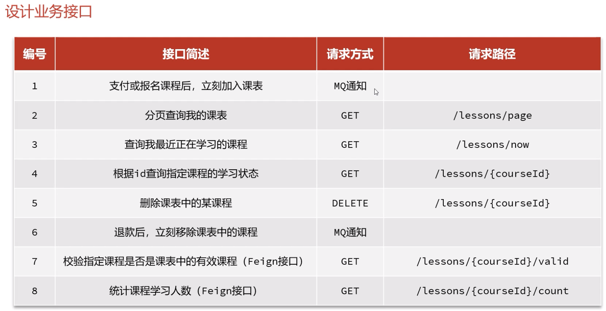

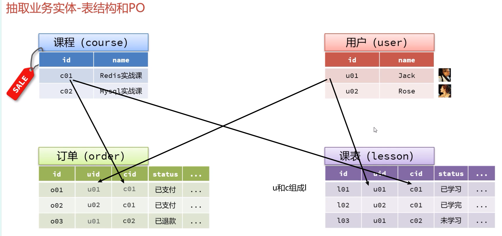

课表 learning_lesson

课表id是根据用户userId和课程courseId唯一决定的。

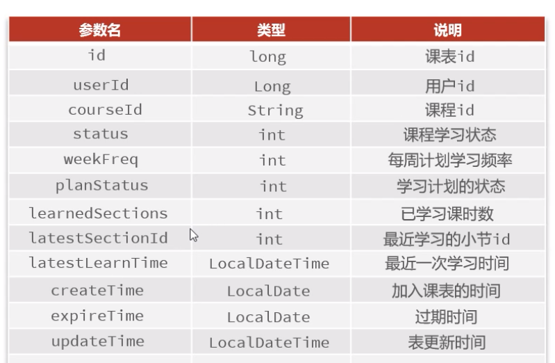

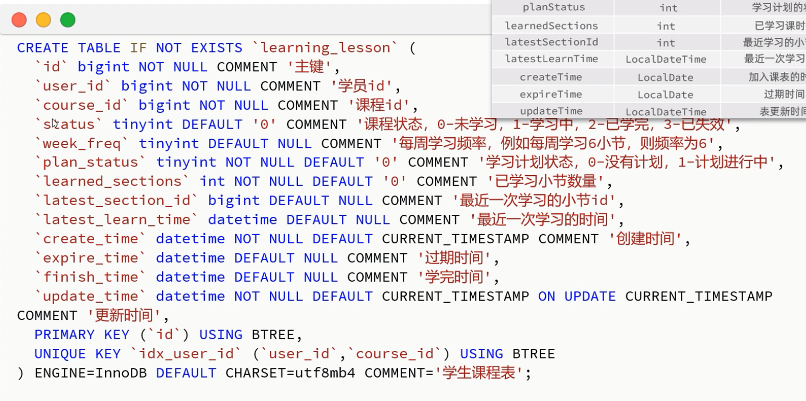

### 添加课程到课程表

tianji/tj-learning/src/main/java/com/tianji/learning/mq/LessonChangeListener.java

tianji/tj-learning/src/main/java/com/tianji/learning/service/impl/LearningLessonServiceImpl.java

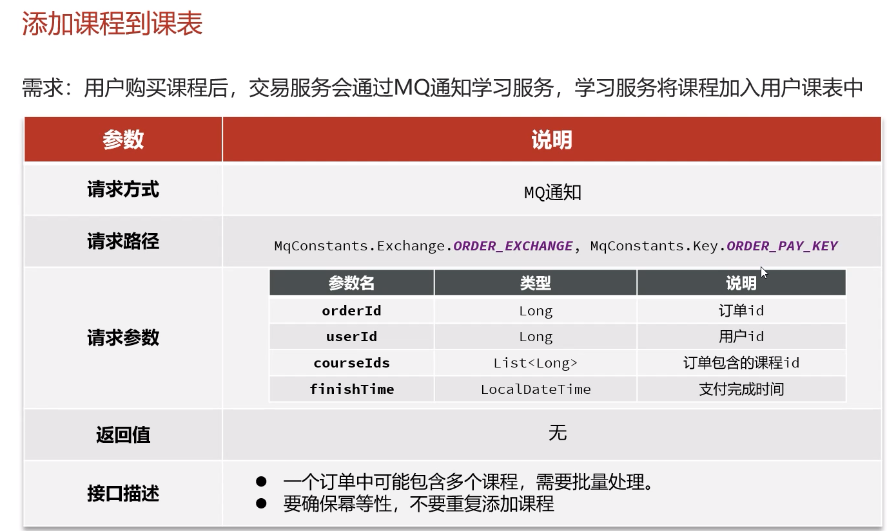

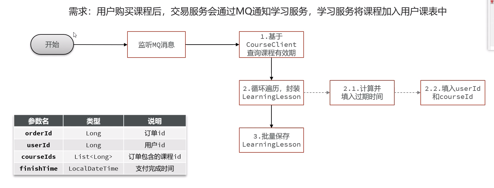

由唯一的联合索引防止重复添加，保证用户幂等性。

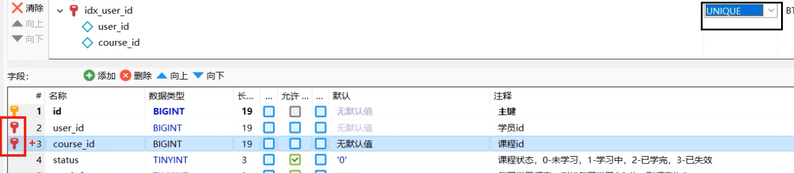

### 分页查询我的课表

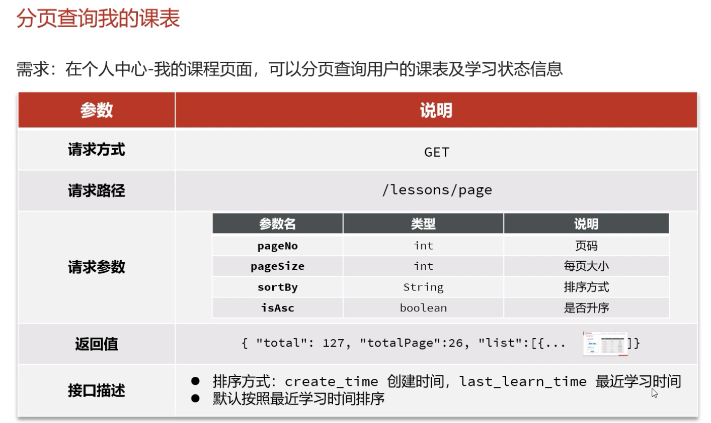

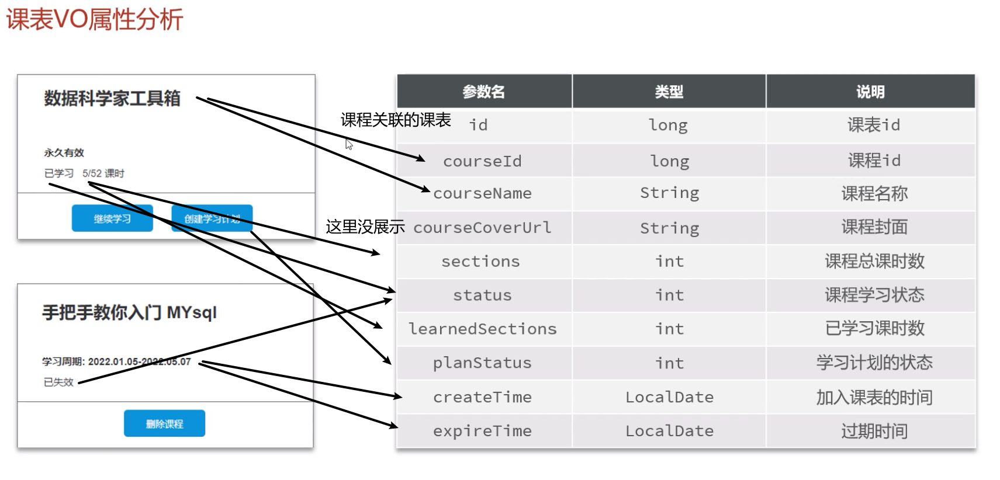

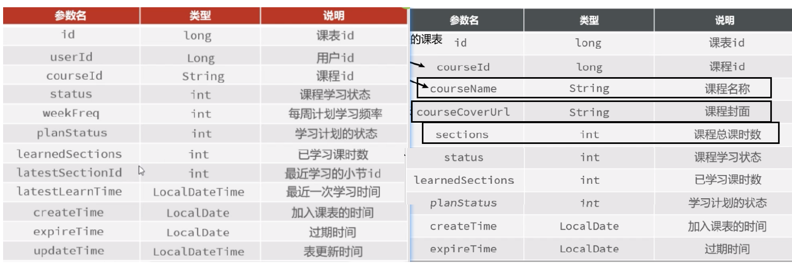


去learning_lesson表中查询，LearningLessonVO的剩下3个字段去 course 表中查询


### 查询最近正在学习的课程

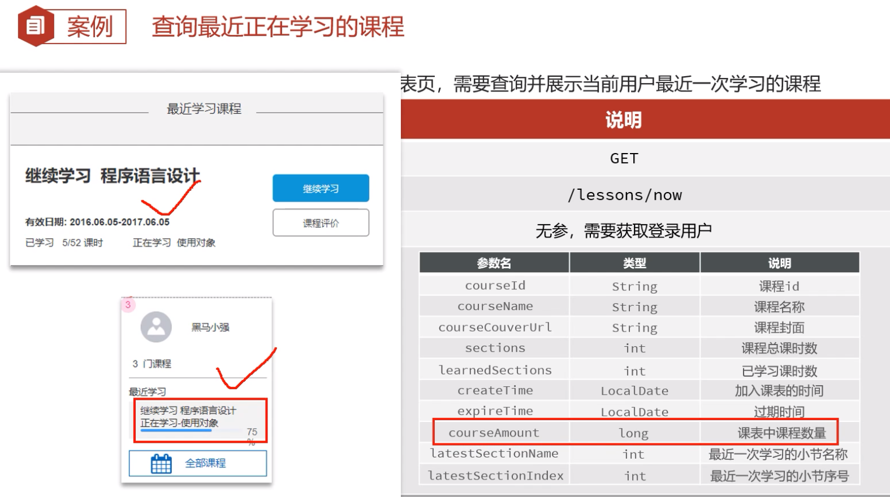

### 根据id查询指定课程的学习状态 

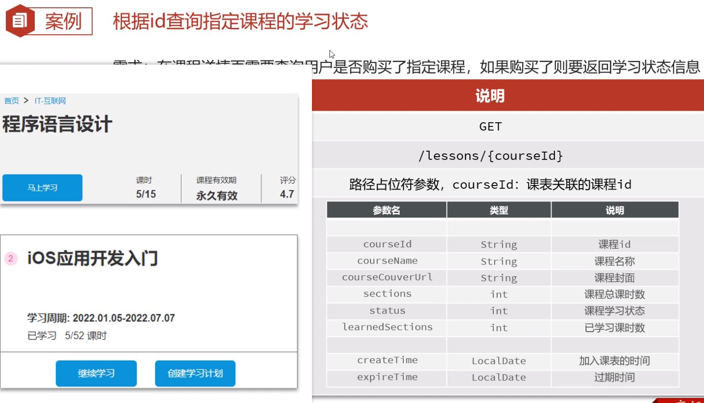

