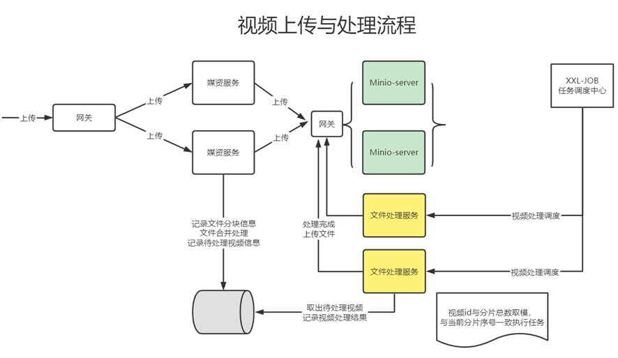
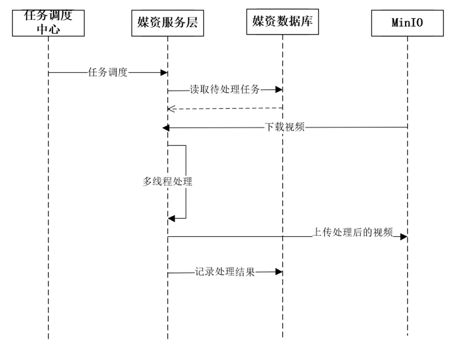

- [媒资](#媒资-1)
  - [媒资模块为什么要建立数据库](#媒资模块为什么要建立数据库)
  - [上传图片过程](#上传图片过程)
  - [断点续传](#断点续传)
  - [分块文件清理](#分块文件清理)
  - [视频转码](#视频转码)

---

## 数据库表

### 课程

课程营销信息和课程基本信息的主键相同。

### 媒资

文件id就是 md5值。

存机构id的意义。可以对机构的云视频资源大小收费。

## 项目开发流程

## 15. 图片分片上传的逻辑是什么？

图片分片上传是一种将大文件分割成多个小片段进行上传的策略，以提高上传效率和稳定性。其基本逻辑如下：

1.  客户端将待上传的图片文件进行分片切割，将文件分割成多个固定大小的片段（chunk）。
2.  客户端按照一定的顺序将这些分片依次上传到服务器端。可以使用HTTP协议的POST请求或其他上传协议进行分片上传。
3.  服务器端接收到每个分片后，将其暂存到临时存储区，通常是磁盘或内存。
4.  当所有分片都上传完成后，服务器端根据上传的顺序将这些分片进行合并，还原成完整的图片文件。
5.  完整的图片文件可以进行进一步的处理，如存储到数据库或文件系统中，或进行其他业务逻辑操作。

在图片分片上传的过程中，还需要考虑以下几个方面的逻辑：

-   分片大小：需要根据实际情况确定每个分片的大小，通常根据网络环境和服务器性能进行调整，以保证上传效率和稳定性。
-   分片顺序：客户端需要按照一定的顺序上传分片，通常是从第一个分片开始，依次上传到最后一个分片。
-   分片校验：客户端可以对每个分片进行校验，例如计算分片的哈希值，以确保分片的完整性和准确性。
-   断点续传：如果上传过程中出现网络中断或其他异常情况，客户端可以记录已上传的分片信息，下次继续上传时可以从断点处继续上传，以实现断点续传的功能。

通过图片分片上传的方式，可以有效地处理大文件的上传，提高上传效率和稳定性，并且可以灵活控制上传过程，适应不同的网络环境和服务器条件。

## 功能

【课程信息】

涉及到课程基本信息 course_base 和课程营销信息 course_market, 这两个表共用同一个主键，相当于一个表拆成两份。

查询：课程查询。

新增：课程分类查询（树形）、添加课程（课程基本信息、营销信息）。

更新：课程更新。

【课程计划】

teachplan 课程计划, teachplan_media 媒资和课程计划关联

# 媒资

## 媒资模块为什么要建立数据库

minio是存文件的，要找到哪个文件是所需要，就得知道文件信息。这个文件信息用数据库来管理。

比如，这个图片在minio中的路径，图片是否已经被上传过了。

## 上传图片过程

前端，点击上传图片→媒资管理服务，在minio中存储文件，添加文件信息到媒资管理数据库中，并返回图片地址给前端。

然后前端保存课程时，就填写了图片地址的属性，内存管理服务就能拿到并保存到内容管理数据库中。

## 断点续传

基于分块上传的模式实现断点续传，重新上传时已经上传的分块不再分块。

（1）前端请求后端检测完整文件是否存在（先去db查记录、有记录再去minio查文件是否存在）。文件存在则不上传。

（2）前端上传前先把文件分成块，再上传分块。

一块一块的上传前，请求后端检测minio中是否存在该分块，已上传的分块则不用再上传。

这样就实现了断点续传。

（3）前端各分块上传完成后，前端请求媒资服务合并分块，后端再向minio合并分块、向db保存媒资信息、校验md5.

## 分块文件清理

上传一半不再传了，minio中的分块文件要清理吗？

（1）数据库中媒资文件表，记录minio中文件信息

（2）媒资文件表中记录文件的状态。文件开始上传时，状态为上传中；文件上传完成，状态为已上传。

（3）上传一半不再传了。我们使用定时任务去查询文件表中的文件状态，如果文件未在规定时间内上传完成，则删除minio中该文件对应的文件目录。

## 视频转码

使用ProcessBuilder来创建Process，命令行调用ffmpeg来转化视频格式。

这个工作使用xxl-job来定时调度完成。

定时调度的意义是，播放器只能播放mp4文件，但有人上传avi文件，所以要转文件形式，但上传时转文件很费性能，所以夜间时间集中转码。

> 如何查询到不重复的任务（作业分片）

分片广播 + 根据分片参数（执行器序号和执行器总数）来取余

> 如何保证任务不重复执行（如果一个执行器在处理一个视频还没有完成，此时调度中心又一次请求调度，为了不重复处理同一个视频该怎么办）

xxl-job上。调度过期策略是**忽略**，阻塞处理策略是**丢弃后续调度**。

且任务本身要保证幂等性（这里使用数据库）。

1、任务调度中心广播作业分片。
2、执行器收到广播作业分片，从数据库读取待处理任务，读取未处理及处理失败的任务。
3、执行器更新任务为处理中，根据任务内容从MinIO下载要处理的文件。
4、执行器启动多线程去处理任务。
5、任务处理完成，上传处理后的视频到MinIO。
6、将更新任务处理结果，如果视频处理完成除了更新任务处理结果以外还要将文件的访问地址更新至任务处理表及文件表中，最后将任务完成记录写入历史表。

> 数据库表

media_process 待处理任务表，处理完后会从media_process中删除，添加已处理的任务到 media_process_history 已处理任务表中。