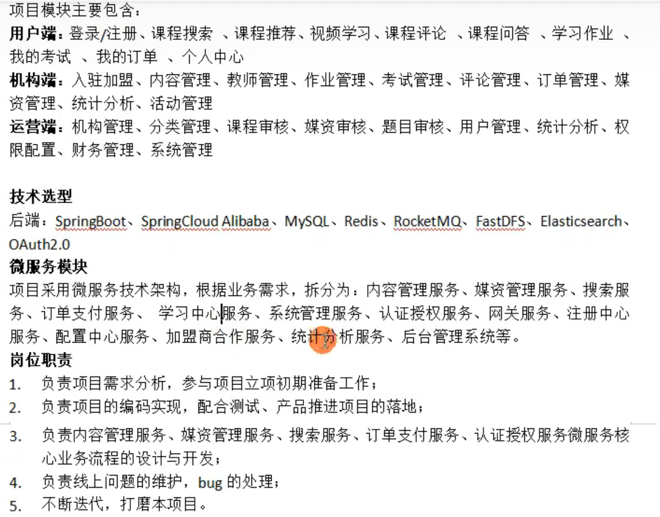
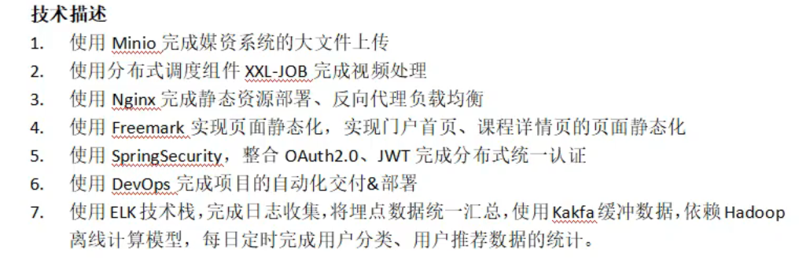
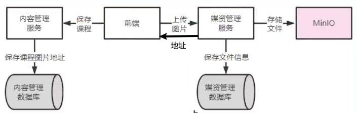
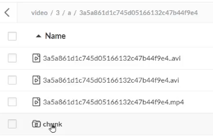

- [媒资](#媒资-1)
  - [媒资模块为什么要建立数据库](#媒资模块为什么要建立数据库)
  - [上传图片过程](#上传图片过程)
  - [断点续传](#断点续传)

---

## 数据库表

### 课程

课程营销信息和课程基本信息的主键相同。

### 媒资

文件id就是 md5值。

## 项目开发流程

## 15. 图片分片上传的逻辑是什么？

图片分片上传是一种将大文件分割成多个小片段进行上传的策略，以提高上传效率和稳定性。其基本逻辑如下：

1.  客户端将待上传的图片文件进行分片切割，将文件分割成多个固定大小的片段（chunk）。
2.  客户端按照一定的顺序将这些分片依次上传到服务器端。可以使用HTTP协议的POST请求或其他上传协议进行分片上传。
3.  服务器端接收到每个分片后，将其暂存到临时存储区，通常是磁盘或内存。
4.  当所有分片都上传完成后，服务器端根据上传的顺序将这些分片进行合并，还原成完整的图片文件。
5.  完整的图片文件可以进行进一步的处理，如存储到数据库或文件系统中，或进行其他业务逻辑操作。

在图片分片上传的过程中，还需要考虑以下几个方面的逻辑：

-   分片大小：需要根据实际情况确定每个分片的大小，通常根据网络环境和服务器性能进行调整，以保证上传效率和稳定性。
-   分片顺序：客户端需要按照一定的顺序上传分片，通常是从第一个分片开始，依次上传到最后一个分片。
-   分片校验：客户端可以对每个分片进行校验，例如计算分片的哈希值，以确保分片的完整性和准确性。
-   断点续传：如果上传过程中出现网络中断或其他异常情况，客户端可以记录已上传的分片信息，下次继续上传时可以从断点处继续上传，以实现断点续传的功能。

通过图片分片上传的方式，可以有效地处理大文件的上传，提高上传效率和稳定性，并且可以灵活控制上传过程，适应不同的网络环境和服务器条件。

## 功能

【课程信息】

涉及到课程基本信息 course_base 和课程营销信息 course_market, 这两个表共用同一个主键，相当于一个表拆成两份。

查询：课程查询。

新增：课程分类查询（树形）、添加课程（课程基本信息、营销信息）。

更新：课程更新。

【课程计划】

teachplan 课程计划, teachplan_media 媒资和课程计划关联

# 媒资
## 媒资模块为什么要建立数据库

minio是存文件的，要找到哪个文件是所需要，就得知道文件信息。这个文件信息用数据库来管理。

比如，这个图片在minio中的路径，图片是否已经被上传过了。

## 上传图片过程

前端，点击上传图片→媒资管理服务，在minio中存储文件，添加文件信息到媒资管理数据库中，并返回图片地址给前端。

然后前端保存课程时，就填写了图片地址的属性，内存管理服务就能拿到并保存到内容管理数据库中。

## 断点续传

1、前端对文件进行分块。
2、前端上传分块文件前请求媒资服务检查文件是否存在，如果已经存在则不再上传。
3、如果分块文件不存在则前端开始上传
4、前端请求媒资服务上传分块。
5、媒资服务将分块上传至MinIO。
6、前端将分块上传完毕请求媒资服务合并分块。
7、媒资服务判断分块上传完成则请求MinIO合并文件。
8、合并完成校验合并后的文件是否完整，如果完整则上传完成，否则删除文件。

（1）前端请求后端检测完整文件是否存在（先去db查记录、有记录再去minio查文件是否存在）。文件存在则不上传。

（2）前端上传前先把文件分成块，再上传分块。

一块一块的上传前，请求后端检测minio中是否存在该分块，已上传的分块则不用再上传。

，上传中断后重新上传，

3、前端各分块上传完成后，前端请求媒资服务合并分块，后端再向db保存媒资信息。

