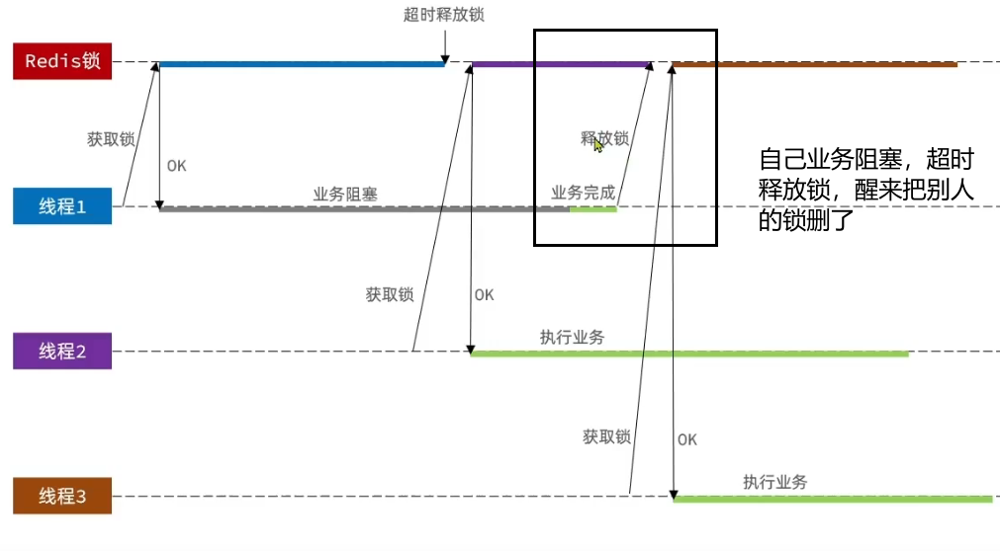
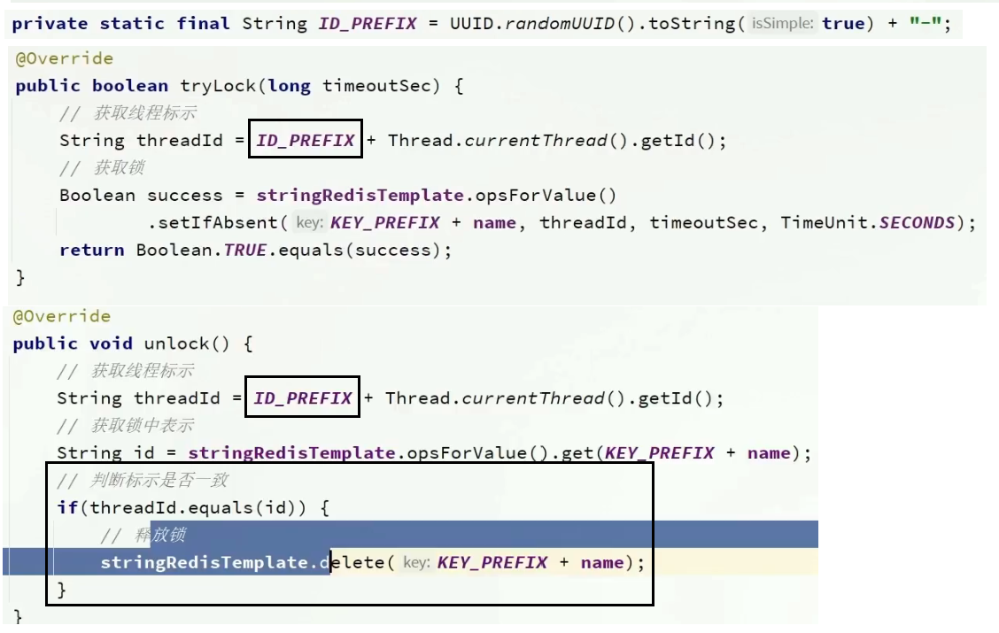
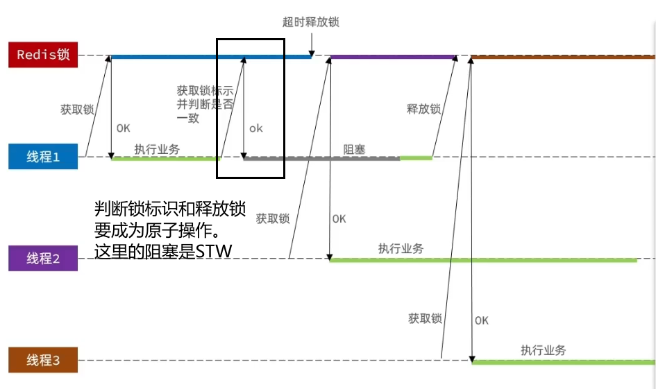

- [1. 短信登陆](#1-短信登陆)
  - [1.1. 发送验证码](#11-发送验证码)
  - [1.2. login](#12-login)
  - [1.3. 校验登录状态](#13-校验登录状态)
  - [1.4. QA](#14-qa)
    - [1.4.1. 为什么用户存储时的key，使用随机字符串的token，而不是手机号？](#141-为什么用户存储时的key使用随机字符串的token而不是手机号)
    - [1.4.2. 用户信息何时存取、何处存取](#142-用户信息何时存取何处存取)
    - [1.4.3. 为什么使用双拦截器而不是一个](#143-为什么使用双拦截器而不是一个)
    - [1.4.4. 为什么登录拦截器的拦截是设置401状态码？](#144-为什么登录拦截器的拦截是设置401状态码)
    - [1.4.5. 为什么刷新拦截器清空UserHolder](#145-为什么刷新拦截器清空userholder)
    - [1.4.6. logout优化](#146-logout优化)
- [2. 店铺缓存](#2-店铺缓存)
  - [2.1. 空值问题](#21-空值问题)
  - [2.2. CacheClient](#22-cacheclient)
  - [2.3. 值得一提的一个代码](#23-值得一提的一个代码)
- [3. 优惠券秒杀](#3-优惠券秒杀)
  - [3.1. 全局唯一id怎么设计的？](#31-全局唯一id怎么设计的)
  - [3.2. Redis 自增 ID](#32-redis-自增-id)
  - [3.3. 秒杀](#33-秒杀)
  - [3.4. 库存超卖怎么产生的？如何解决？](#34-库存超卖怎么产生的如何解决)
  - [3.5. 一人一单](#35-一人一单)
    - [3.5.1. synchronized锁细节](#351-synchronized锁细节)
    - [3.5.2. 分布式锁](#352-分布式锁)
      - [3.5.2.1. 不可重入的Redis分布式锁](#3521-不可重入的redis分布式锁)
      - [3.5.2.2. 可重入的Redisson分布式锁](#3522-可重入的redisson分布式锁)
      - [3.5.2.3. multiLock](#3523-multilock)
  - [3.6. 秒杀业务的优化：基于阻塞队列的异步秒杀](#36-秒杀业务的优化基于阻塞队列的异步秒杀)


---

- 使用token+Redis代替session做登录校验，解决了session共享问题，并使用ThreadLocal保存线程用户。
- 使用分布式读写锁解决缓存击穿问题，优化了传统分布式互斥锁的实现方式，平均响应时间降低5ms。
- 使用布隆过滤器+缓存空值解决缓存穿透问题。
- 利用Redission分布式锁解决方案处理优惠券秒杀并发问题，并结合令牌桶限流算法限流。
- 使用Redis生成全局唯一ID供异步下单使用。
- 采用Redis的HyperLogLog数据类型并结合定时任务实现系统的日活量数据入库。
- 采用Redis的BitMap实现用户签到和签到统计。
- 采用Redis的GEO实现附近店铺展示并计算距离。
- 基于List来完成点赞列表的操作，同时基于SortedSet来完成点赞的排行榜功能
- 好友关注基于Set集合的关注、取消关注、共同关注

# 1. 短信登陆

技术选型：
- [ ] 基于 session 实现登录
- [x] 基于 redis+ 令牌：用 redis 代替 session 实现登录

涉及代码：
- UserController：`sendCode`, `login`, `logout`, `me`
- 刷新拦截器，登录拦截器

## 1.1. 发送验证码


redis 直接以**手机号作为 key**，验证码作为 value，并设置过期时间。


## 1.2. login

1. 校验验证码：根据 LoginFormDTO 中填写的手机号，作为 key 去 redis 中查，不存在说明验证码过期，存在而不匹配则说明验证码错误。
2. 检验用户：去db根据手机号查用户，不存在则创建新用户。
3. 生成token：UUID。
4. **redis存User**：使用 hash 类型存储，**key 是token**，value是User各字段。
5. 返回响应：内容是token。以后前端发送请求时，**在header中携带token**。

PS；好像不用hash类型，用string也行，估计是练习hash才选的。


## 1.3. 校验登录状态


双拦截器：刷新拦截器→登录拦截器
- 刷新拦截器中拦截所有的路径
- 登录拦截器拦截需要登录的路径。
  
刷新拦截器：都拦截；preHandler都放行，afterCompletion 清空 threadLocal

preHandler: 根据令牌在 redis 中取出用户、获取用户信息存入到 threadLocal、刷新用户有效期
- 无token时，结束
- 用户在redis中不存在时，结束
- redis有用户：存入 threadLocal，并刷新token


登录拦截器：只拦截敏感资源
- 判断 threadLocal 中用户是否存在。
- 不存在，则没登录，要拦截。
- 存在，则已登录，放行。 


## 1.4. QA
### 1.4.1. 为什么用户存储时的key，使用随机字符串的token，而不是手机号？

如果仅是后端存储，那么都行。但这个token还要返回给前端，以后前端每次请求都要携带这个token，那么直接将手机号作为token不安全，只要知道手机号就可以登录。

所以使用随机字符串的token，来保证安全性。具体采用UUID。

### 1.4.2. 用户信息何时存取、何处存取

存入redis中：是在login

从redis中取 + 存入UserHolder：是在刷新拦截器

清空UserHolder：刷新拦截器的afterCompletion

从redis中删除：logout

### 1.4.3. 为什么使用双拦截器而不是一个

解决只有一个拦截器则无法刷新的问题。

只有一个拦截器，则无法对不需要拦截的路径生效，从而无法刷新redis中User有效期。

### 1.4.4. 为什么登录拦截器的拦截是设置401状态码？

前端接受到401状态码后，就知道是没有登录的问题，设置跳转到登录页面。
```js
// commons.js
axios.interceptors.response.use(function (response) {
  // 判断执行结果
  if (!response.data.success) {
    return Promise.reject(response.data.errorMsg)
  }
  return response.data;
}, function (error) {
  // 一般是服务端异常或者网络异常
  console.log(error)
  if(error.response.status == 401){     // <<<<<<<<<<<<<
    // 未登录，跳转
    setTimeout(() => {
      location.href = "/login.html"
    }, 200);
    return Promise.reject("请先登录");
  }
  return Promise.reject("服务器异常");
});
```
### 1.4.5. 为什么刷新拦截器清空UserHolder

搞清楚：清空UserHolder≠退出当前登录
- 真正存储当前登录User的是redis，UserHolder只是一个存储从redis中获取User的临时拷贝。
- 正因为是拷贝redis，所以每次请求都要拦截，而不是拦截一次就不再拦截了；每次的请求preHandle都要存新的和afterCompletion清空旧的。
- 其他代码能看见UserHolder，并不是因为它一直持有User，而是每次都会放入新的。

### 1.4.6. logout优化

登出, 前端你会删除自己的header中的Authorization.

黑马给的代码：`UserHolder.removeUser()`, 不写也一样。 本来这就是临时的，会被刷新拦截器的afterCompletion给删除。redis中的User还在，虽然会自己过期，但如果有人偷了token，那么就能登录。

关键是redis中删除：我们控制器传入 `HttpServletRequest`，取出 token 来删除 redis中的 User。

# 2. 店铺缓存

技术选型：
- 读：缓存空值 + 互斥锁（逻辑过期也实现了）
- 写：先写后删。

涉及代码：
- `ShopController`: 店铺信息
  - `queryShopById()`: 查询店铺信息。redis→mysql。缓存击穿、缓存穿透
  - `updateShop()`: 更新店铺信息。先写后删。没有前端界面，只能去postman测试
  - `saveShop()`：只存db。
- `ShopTypeController`: 店铺类型信息
  - `queryShopTypes()`: 查询店铺类型信息。同理。
- `CacheClient`: redis缓存问题封装

## 2.1. 空值问题

`queryShopById()` 中写了三种方式：
- 只解决空值: `cacheClient.queryWithPassThrough`
- 逻辑过期 + 预热: `cacheClient.queryWithLogicalExpire`
- 互斥锁 + 缓存空值: `cacheClient.queryWithMutex`

逻辑过期的预热，也能解决空值问题————逻辑过期的redis命中机制和互斥锁的不一致，互斥锁是redis命中不了还去db查再记录空值，逻辑过期则是命中不了就说明数据库中真没有，因为预热已经全部加载了。

那么从这种实现上，逻辑过期和互斥锁的区别：
- 空值：逻辑过期靠预热来解决空值，空值绝对不会去db；互斥锁的空值过期了，还要去db查。
- TTL：逻辑过期的数据没有ttl，永不过期；互斥锁的数据有ttl。

## 2.2. CacheClient

逻辑过期，使用线程池。

## 2.3. 值得一提的一个代码

```java
// 判断命中的是否是空值
// 为什么不是 json.isEmpty() 或者 json.length() == 0，这样不是更明显表达是空值吗？因为json为null时，没有方法，调用方法还得多写 if(json != null && json.isEmpty())
if (json != null) {
    // 返回一个错误信息
    return null;
}
```

# 3. 优惠券秒杀

优惠劵：自增。包含普通劵（数量无限、活动时间无限）和秒杀券（数量有限、活动限定时间）。

秒杀劵：继承优惠劵，主键用优惠劵的 id。添加属性是，库存和时间（生效、失效）。

优惠券的订单表：全局唯一 id，不用数据库的自增，使用 redis 自增

涉及代码：
- `RedisIdWorker`: 全局唯一id
- `VoucherController`: 
  - `addSeckillVoucher`: 新增秒杀券
  - `addVoucher`: 新增普通券
  - `queryVoucherOfShop`: 查询店铺的优惠券列表
- `VoucherOrderController`:
  - `seckillVoucher`: 秒杀抢券（都行，还是只有秒杀券可以）
## 3.1. 全局唯一id怎么设计的？

**全局 ID 生成器**的特性: 在**分布式系统**下用来生成全局唯一 ID 的工具

- 唯一性
- 递增性：有序有利于数据库插入索引。
- 安全性：规则还不能太明显
- 高可用
- 高性能：能够迅速生成大量的 id。

方案：

- 数据库自增
- UUID
- 雪花算法
- Redis 自增

数据库自增 ID 就存在一些问题：

- 自增 id 的规律性太明显。订单号容易被猜出来，不安全
- 受单表数据量的限制。分库分表后，表各自自增，不统一，他们从逻辑上讲他们是同一张表，所以他们的 id 是不能一样的，这点数据库满足不了。

## 3.2. Redis 自增 ID

- 64bit：符号位 0+ 时间戳 + 计数器
    
    
- 时间戳: 每秒一个。具体是，当前的秒数减去设定的起始秒数。
- 计数器：每天一个 key，每天从零开始自增，方便统计订单量。

    ```java
    // 计数器
    String date = now.format(DateTimeFormatter.ofPattern("yyyy:MM:dd"));
    long count = stringRedisTemplate.opsForValue().increment("icr:" + keyPrefix + ":" + date);
    return timestamp << 32 | count;
    ```
## 3.3. 秒杀


## 3.4. 库存超卖怎么产生的？如何解决？

原因：因为是先查后更新，查询快而更新慢，从而线程不安全，扣库存是已经是负数了。


解决：**扣库存update时加锁**

- 悲观锁：添加同步锁，让线程串行执行。

- 乐观锁：不加锁，只在更新时判断是否有其他线程在修改。无修改，则更新；有修改，则重试或异常。
  	- 版本号法、cas法（融合版本号，判断是否是原值）
  	- 解决成功率低：where stock > 0

    

    

## 3.5. 一人一单


做法：去db查该用户是否有该券的订单记录，没有记录才执行秒杀下单操作。

但同样存在先查再改的线程安全问题。查耗时，会同时判定通过，所以要将查单和下单同时锁起来。

- 不能用乐观锁，因为数据没有被修改过，这里订单还不存在。

- synchronized锁。但在集群下失效，不同JVM内部的常量池让锁失效了。

- 分布式锁。

### 3.5.1. synchronized锁细节

1. 锁this对象。锁太大，任何用户都是同一把锁。一人一单的需求是，同一用户才加锁，不同用户不加锁。

    
    

2. 锁用户id，这样同一用户才被锁住，不同用户不会被锁住。
   	- toString()：因为同一用户重新登录，用户对象就不同，userId值相同对象不同。所以要值加锁。
   	
        
   	- intern()：因为Long的toString()内部是new String()，所以要转为字符串常量池的对象。
   	
        

3. 事务没提交就释放锁，那么新获得锁的线程查询时数据不存在，依然有线程并发安全问题：应该锁整个事务，事务提交后再释放锁

    

4. 事务不生效：aspectj
	

    

    

    

    


### 3.5.2. 分布式锁

分布式锁：

- mysql

- zookeeper：节点唯一性和有序性

- redis：基于setnx实现；Redisson。


#### 3.5.2.1. 不可重入的Redis分布式锁

set nx ex，存线程UUID，lua脚本判断线程标示并删除

1. 升级一：setnx原子性

    →setnx加锁+del释放。

    →expire锁超时释放（解决del前宕机而死锁）

    →set lock value ex 10 nx（原子操作，解决expire前宕机）

    <details>

    

    这里的 value 暂时用不到。

    

    

    </details>


2. 升级二：

    →锁存线程UUID，del锁判断是否是自己（业务阻塞而锁过期，业务恢复而删除了B业务的锁，让C业务申请到了而和B业务同时执行）

    <details>

    

    

    </details>

3. 升级三：unlock原子性

    →判断锁标识和释放成为原子性，LUA脚本（判断后阻塞，超时释放，释放锁又释放别人的锁了）

    <details>

    

    

    </details>

仍然缺陷：
- 不可重入：同一个线程无法多次获取同一把锁
- 无法重试：线程尝试获取锁一次后返回false，没有重试等待机制。
- 业务耗时久而导致锁超时失效
- 主从一致性：主获取锁写入数据宕机，从节点未同步锁，其他线程再去获取锁就死锁了。


#### 3.5.2.2. 可重入的Redisson分布式锁

- 可重入：利用hash结构记录线程id和重入次数。

- 可重试：利用信号量和发布订阅功能实现等待唤醒，获取锁失败的重试机制。

- 超时续约：利用watchdog，每隔一段时间重置超时时间。


缺陷：主从模式下redis主节点宕机引起锁失效。


#### 3.5.2.3. multiLock

- 多个独立的Redis结点

- 去每个节点都获取锁。只有所有节点都获取重入锁，才算取锁成功。

缺陷：运维成本高、实现复杂。


## 3.6. 秒杀业务的优化：基于阻塞队列的异步秒杀

将抢单业务和下单业务分离。

1. redis负责判断库存、一人一单，将订单放入阻塞队列。
2. 独立线程异步下单，从阻塞队列中取出，完成数据库操作。

缺陷：
- 内存限制：阻塞队列是基于JDK的BlockQueue，虽然设置了容量上线，但占用JVM总内存。
- 数据安全：宕机丢失、阻塞队列取出后如果出错就无法恢复订单。