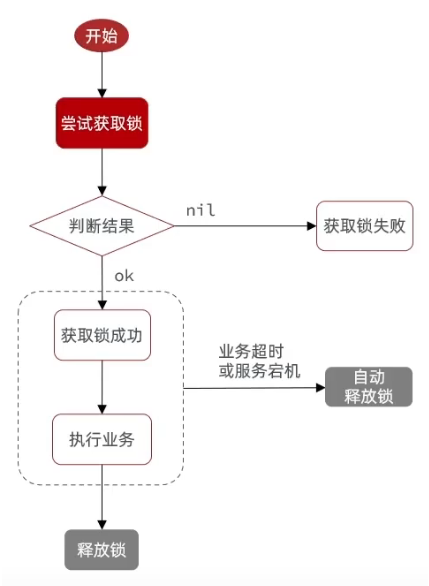
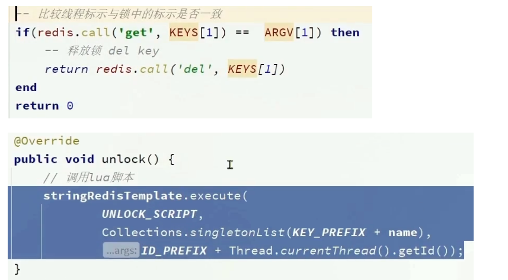

- [1. 短信登陆](#1-短信登陆)
  - [1.1. 基于 session](#11-基于-session)
  - [1.2. 基于 redis+ 令牌](#12-基于-redis-令牌)
- [3. 优惠券秒杀](#3-优惠券秒杀)
  - [3.1. 全局唯一 id](#31-全局唯一-id)
  - [3.2. 秒杀](#32-秒杀)
  - [3.3. 库存超卖](#33-库存超卖)
  - [3.4. 一人一单](#34-一人一单)
    - [3.4.1. synchronized锁细节](#341-synchronized锁细节)
    - [分布式锁](#分布式锁)
      - [不可重入的Redis分布式锁](#不可重入的redis分布式锁)
      - [可重入的Redisson分布式锁](#可重入的redisson分布式锁)
      - [multiLock](#multilock)
  - [秒杀业务的优化：基于阻塞队列的异步秒杀](#秒杀业务的优化基于阻塞队列的异步秒杀)


---
# 1. 短信登陆

实现方案：

- 基于 session 实现登录
- 基于 redis+ 令牌：用 redis 代替 session 实现登录
- session 方案和 redis 方案都有过期时间：session 有过期时间，30 分钟。

1. session 中保存 UserDTO，那么登录拦截器，保存的是完整的 User 吗
2. redis，为什么不能直接保存 User？流程图和登录拦截器匹配不上，在登录拦截器中，没有则拦截，有则更新过期时间。

## 1.1. 基于 session


发送验证码：验证码保存在 session 中，session 在服务端 tomcat 中。


login 登录：

1. 前端传来的数据里有用户填写的手机号和验证码，session 里真验证码。比较填写验证码和真验证码是否一致。
2. 手机号去查 db 查用户。有，则将用户保存在 session 中。无，则创建用户并保存。
3. session 会话结束，以后前端发送的请求 cookie 中记录 session id。

登录拦截器（校验登录状态）：

1. 使用拦截器拦截用户请求，根据用户是否存在而拦截或放行。
2. 请求中有 cookie，cookie 中有 session id，服务端根据 session 找到 session，取出其中的用户。
3. 有则放行请求。将用户 UerDTO 保存在 ThreadLocal 线程局部变量（UserHolder 里）。
4. 无则拦截请求。


PS：

- session 中保存用户，使用 UserDTO 而不是 User：隐藏 User 的敏感信息如密码，只存用户 id 和昵称。
- 为什么要存储在 ThreadLocal 中，不能每次都去 session 中找吗？
  第一，现在就是每次都去 session 中找用户。
  第二，你理解的每次都去 session 中是指像发送验证码和 login 一样去传入的 session 变量，那样确实可以，但现在处理的是普通方法，可以共同抽取这段获取用户再判断是否 null 的代码，这就是拦截器的意义。
  第三，校验登录状态是在拦截器中，拦截器可以获取 session，放入 ThreadLocal 传递给其他方法。


## 1.2. 基于 redis+ 令牌


发送验证码：不需要 cookie 记录别的信息。redis 直接以手机号作为 key，验证码作为 value，并设置过期时间。

login 时：

1. 不需要 cookie 记录别的信息。根据 LoginFormDTO 中填写的手机号，作为 key 去 redis 中查，不存在说明验证码过期，存在而不匹配则说明验证码错误。
2. 不将用户保存在 session 中，而是直接存在 redis 中，使用 hash 类型存储，key 是令牌。
3. 以后前端发送请求时，携带令牌。

校验登录状态：

1. 前端携带令牌发送请求，我们根据令牌~~在~~ redis 中取出用户。
2. 无，则拦截。
3. 有，则存入到 ThreadLocal 中，并刷新用户的有效期，放行。

PS：

- 使用 hash 类型：节省内存，可以对字段 CRUD。
- key 是令牌而不是手机号：前端后携带令牌，所以相比手机号，随机令牌更安全。
- 令牌，可以是 uuid 随机
- 双拦截器：之前的拦截器无法对不需要拦截的路径生效，从而无法刷新。
  第一个拦截器中拦截所有的路径，第而个拦截器中拦截需要登录的路径。
  第一个拦截器都放行，根据令牌~~在~~ redis 中取出用户、获取用户信息存入到 threadLocal、刷新用户有效期，第二个拦截器才拦截，判断 threadLocal 中用户是否存在。
- 退出登录：**我们需要清除 ThreadLocal 里存放的用户信息**，这样前端发送的请求获取不到用户信息，登录拦截器从 ThreadLocal 中获取用户也为 null，被拦截跳到登录界面。


# 3. 优惠券秒杀

优惠劵：自增。包含普通劵和秒杀券。

秒杀劵：继承优惠劵，主键用优惠劵的 id。添加属性库存和时间（创建、生效、失效）。

优惠券的订单表：全局唯一 id，不用数据库的自增，使用 redis 自增

## 3.1. 全局唯一 id

**全局 ID 生成器**的特性**：**在**分布式系统**下用来生成全局唯一 ID 的工具

- 唯一性
- 递增性：有序有利于数据库插入索引。
- 安全性：规则还不能太明显
- 高可用
- 高性能：能够迅速生成大量的 id。

方案：

- 数据库自增
- UUID
- 雪花算法
- Redis 自增

数据库自增 ID 就存在一些问题：

- 自增 id 的规律性太明显。订单号容易被猜出来，不安全
- 受单表数据量的限制。分库分表后，表各自自增，不统一，他们从逻辑上讲他们是同一张表，所以他们的 id 是不能一样的，这点数据库满足不了。

Redis 自增 ID：

- 64bit：符号位 0+ 时间戳 + 计数器
    
    
- 计数器：使用 redis 自增，每天一个 key，方便统计订单量

    ```java
    // 计数器
    String date = now.format(DateTimeFormatter.ofPattern("yyyy:MM:dd"));
    long count = stringRedisTemplate.opsForValue().increment("icr:" + keyPrefix + ":" + date);
    return timestamp << 32 | count;
    ```

## 3.2. 秒杀


## 3.3. 库存超卖

因为线程不安全，扣库存是已经是负数了。


**扣库存update时加锁**

- 悲观锁：添加同步锁，让线程串行执行

- 乐观锁：不加锁，只在更新时判断是否有其他线程在修改。无修改，则更新；有修改，则重试或异常。
  	- 版本号法、cas法（融合版本号，判断是否是原值）
  	- 解决成功率低：where stock > 0

    

    

## 3.4. 一人一单

做法：去db查该用户是否有订单记录，没有记录才执行秒杀下单操作。

但查耗时，会同时判定通过，所以要将查单和下单同时锁起来。

- synchronized锁。但在集群下失效，不同JVM内部的常量池让锁失效了。

- 分布式锁。

### 3.4.1. synchronized锁细节

1. 锁this对象。锁太大，任何用户都是同一把锁。一人一单的需求是，同一用户才加锁，不同用户不加锁。

    

2. 锁用户id，这样同一用户才被锁住，不同用户不会被锁住。
   	- toString()：因为同一用户重新登录，用户对象就不同，userId值相同对象不同。所以要值加锁。
   	
        
   	- intern()：因为Long的toString()内部是new String()，所以要转为字符串常量池的对象。
   	
        

3. 事务没提交就释放锁：应该锁整个事务，事务提交后再释放锁

    

4. 事务不生效：aspectj
	

    

    

    

    

### 分布式锁

分布式锁：

- mysql

- zookeeper：节点唯一性和有序性

- redis：基于setnx实现；Redisson。


#### 不可重入的Redis分布式锁

set nx ex，存线程UUID，lua脚本判断线程标示并删除

1. 升级一：setnx原子性

    →setnx加锁+del释放。

    →expire锁超时释放（解决del前宕机而死锁）

    →set lock value ex 10 nx（原子操作，解决expire前宕机）

    <details>

    

    </details>


2. 升级二：

    →锁存线程UUID，del锁判断是否是自己（业务阻塞而锁过期，业务恢复而删除了B业务的锁，让C业务申请到了而和B业务同时执行）

    <details>

    

    

    </details>

3. 升级三：unlock原子性

    →判断锁标识和释放成为原子性，LUA脚本（判断后阻塞，超时释放，释放锁又释放别人的锁了）

    <details>

    

    

    </details>

仍然缺陷：
- 不可重入：同一个线程无法多次获取同一把锁
- 无法重试：线程尝试获取锁一次后返回false，没有重试等待机制。
- 业务耗时久而导致锁超时失效
- 主从一致性：主获取锁写入数据宕机，从节点未同步锁，其他线程再去获取锁就死锁了。


#### 可重入的Redisson分布式锁

- 可重入：利用hash结构记录线程id和重入次数。

- 可重试：利用信号量和发布订阅功能实现等待唤醒，获取锁失败的重试机制。

- 超时续约：利用watchdog，每隔一段时间重置超时时间。


缺陷：主从模式下redis主节点宕机引起锁失效。


#### multiLock

- 多个独立的Redis结点

- 去每个节点都获取锁。只有所有节点都获取重入锁，才算取锁成功。

缺陷：运维成本高、实现复杂。


## 秒杀业务的优化：基于阻塞队列的异步秒杀

将抢单业务和下单业务分离。

1. redis负责判断库存、一人一单，将订单放入阻塞队列。
2. 独立线程异步下单，从阻塞队列中取出，完成数据库操作。

缺陷：
- 内存限制：阻塞队列是基于JDK的BlockQueue，虽然设置了容量上线，但占用JVM总内存。
- 数据安全：宕机丢失、阻塞队列取出后如果出错就无法恢复订单。