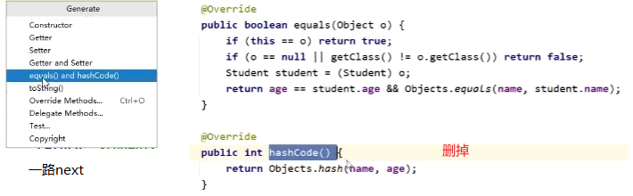
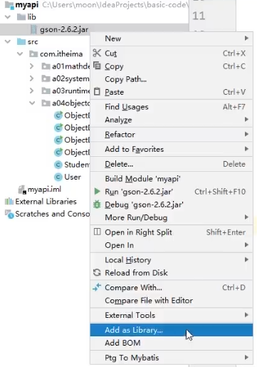
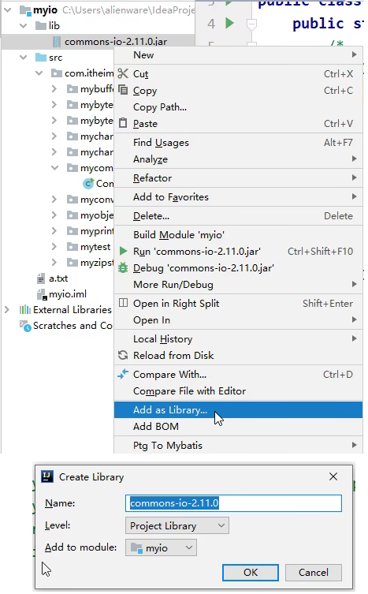
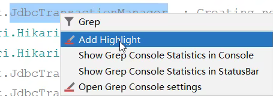
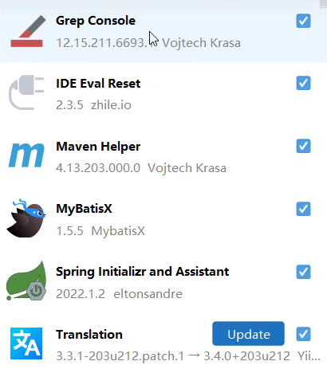

IDEA自动重写: alt + insert 

Java Bean生成： IDEA自动重写
- constructor: 'Select None' 和 全选
- Getters and Setters

利用插件ptg生成JavaBean

alt+7: 函数大纲

ctrl+f12：查找函数

shift+f6: 选中单词全部修改

ctrl+shift+u: 单词全大写

鼠标滚轮：矩阵选中

alt+enter: 修复报错

ctrl+alt+v: 自动生成左边的类型和变量名。

ctrl+alt+t: try-catch捕获

导入jar包：

- 第一个函数是自己的。
- 第二个函数是`→`，表示继承自`Map`中。
- 第三个函数是`↑`，表示继承并重写自`Map`中。

## jar包

## 插件

MyBatisX: mybatis的sql之xml配置

Grep Console: console 高亮某个字段

