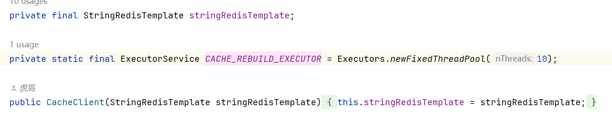
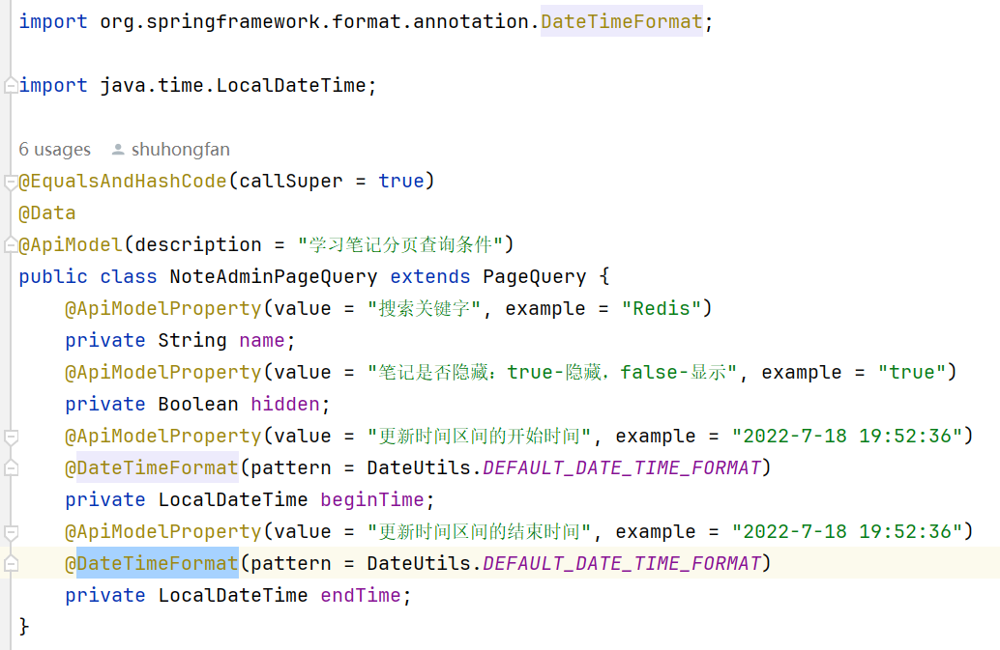
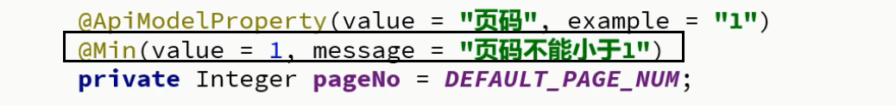

- [ ]  这个final什么意思
- [ ] 有么有区别大吗？

    ```
    url: jdbc:mysql://127.0.0.1:3306/mp?useUnicode=true&characterEncoding=UTF-8&autoReconnect=true&serverTimezone=Asia/Shanghai&rewriteBatchedStatements=true
    ```

    涉及批量更新 `rewriteBatchedStatements=true`

---
0429

- [ ] 标记

    

    

    `import javax.validation.constraints.Min;`